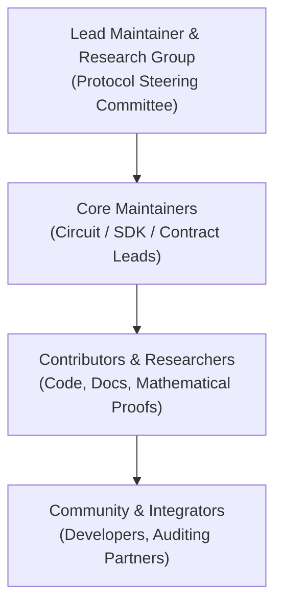

# Project Governance Model

This document outlines the governance structure, decision-making processes, and maintainer responsibilities for the **Proof of Human Intent (PoHI)** open-source protocol and research project.

---

## 1. Governance Principles

The PoHI project operates under a meritocratic, transparent, and security-centric governance model built around three core principles:

1. **Scientific & Cryptographic Integrity**: Protocol modifications, zero-knowledge circuit revisions, and mathematical parameter changes must be rigorously justified by formal proofs, peer-reviewed literature, or empirical data.
2. **Community Transparency**: Architectural discussions, threat vector evaluations, and roadmap prioritization occur publicly within GitHub issues, pull requests, and documentation.
3. **Decoupled Independence**: The open-source protocol specification remains independent of any single commercial entity, protecting the neutrality of the zero-knowledge verification standard.

---

## 2. Governance Roles

### 2.1 Lead Maintainer & Protocol Steering Committee
The Protocol Steering Committee (consisting of the Protocol Research Group, Security Architecture Taskforce, and Lead Maintainer) holds ultimate responsibility for:
- Strategic roadmap direction and whitepaper specification updates.
- Approval of Protocol Specification Proposals (PSPs).
- Security policy enforcement and vulnerability response ([SECURITY.md](SECURITY.md)).
- Release authorization for core ZK circuits and smart contract deployments.

**Current Lead Maintainer**: Alejandro Gutiérrez.

### 2.2 Core Maintainers
Core Maintainers are recognized contributors granted write and review authority over specific repository sub-packages:
- **Circuit Maintainer**: Responsible for `circuits/` Circom R1CS definitions and proof system configurations.
- **SDK Maintainer**: Responsible for `@pohi-protocol/sdk-web` and native mobile bindings.
- **Contracts Maintainer**: Responsible for Solidity smart contracts (`PoHIEscrow.sol`).

### 2.3 Contributors
Anyone who submits code, documentation, test suites, or research analysis is a contributor. Sustained, high-impact contributions lead to Core Maintainer invitation upon Steering Committee review.

---

## 3. Decision-Making & Proposal Process

### Protocol Specification Proposals (PSPs)
Any breaking change to core mathematical formulas (Equations 3.1–3.7), R1CS arithmetic circuit structures, EVM verifier interfaces, or public input signals requires a formal **Protocol Specification Proposal (PSP)**:

1. **Proposal Submission**: Open a PSP RFC issue detailing problem statement, proposed mathematical/circuit modifications, and security trade-off analysis.
2. **Review & Discussion**: A minimum 14-day public review period for community and researcher feedback.
3. **Consensus & Approval**: Approval requires unanimous consensus among the Protocol Steering Committee following security audit verification.

The PSP register is maintained at [docs/psp/](docs/psp/README.md). Proposals are recorded there with their status; no release may be certified while a PSP affecting it remains unratified.

### Trusted Setup Authority
Release authorization for core ZK circuits (Section 2.1) includes authority over the Groth16 trusted setup. Any change to the constraint system invalidates the existing proving key and requires a new ceremony under [docs/CEREMONY.md](docs/CEREMONY.md). A release whose ceremony transcript is unpublished or whose phase-1 contribution is not production-grade must not be certified.

---

## 4. Conflict Resolution & Code of Conduct

In the event of technical disagreements that cannot be resolved through consensus, the Lead Maintainer makes the final determination guided by whitepaper mathematical constraints and security guarantees.

All participants must adhere to [CODE_OF_CONDUCT.md](CODE_OF_CONDUCT.md). Code of Conduct violations should be reported directly to **[alejandro.gutierrezb31@gmail.com](mailto:alejandro.gutierrezb31@gmail.com)**.

---

## 5. Contact Information

- **Lead Maintainer**: Alejandro Gutiérrez
- **Email**: [alejandro.gutierrezb31@gmail.com](mailto:alejandro.gutierrezb31@gmail.com)
- **Repository**: [https://github.com/ProjectOne2020/pohi-protocol-poc](https://github.com/ProjectOne2020/pohi-protocol-poc)
- **LinkedIn**: [https://www.linkedin.com/in/alejandro-guti%C3%A9rrez-9a0318107/](https://www.linkedin.com/in/alejandro-guti%C3%A9rrez-9a0318107/)
