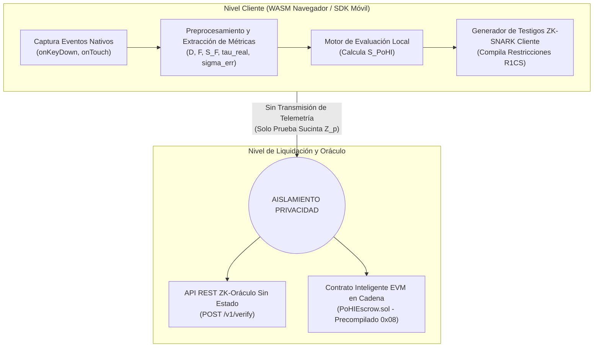
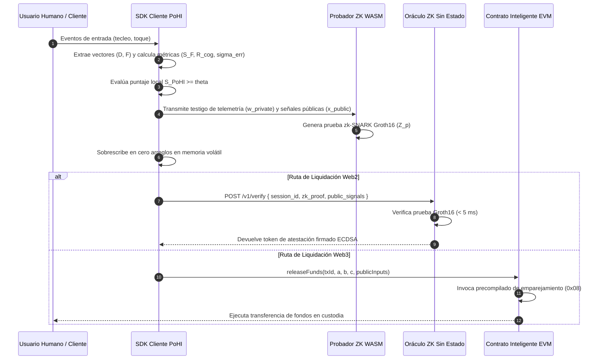

# Demostración de Intención Humana (PoHI)

[](LICENSING.md)
[](#clasificacion)
[](#arquitectura-del-sistema)
[](#especificacion-del-circuito-de-conocimiento-cero)
[](#implementacion-de-contrato-inteligente-evm)
[](#estado-del-proyecto)

> **Un Protocolo Conductual con Preservación de Privacidad para la Verificación de Intención Humana en Transacciones Digitales Mediadas por IA**

---

## Tabla de Contenidos

- [Resumen Ejecutivo](#resumen-ejecutivo)
- [El Límite Asintótico de Indistinguibilidad Semántica](#el-limite-asintotico-de-indistinguibilidad-semantica)
- [Paradigma Central: Entropía de Entrada Neuromuscular y Cognitiva Previa a la Ejecución](#paradigma-central-entropia-de-entrada-neuromuscular-y-cognitiva-previa-a-la-ejecucion)
- [Formalización Matemática](#formalizacion-matematica)
  - [Extracción del Vector Neuromuscular](#extraccion-del-vector-neuromuscular)
  - [Asimetría del Tiempo de Vuelo de Fisher-Pearson](#asimetria-del-tiempo-de-vuelo-de-fisher-pearson)
  - [Latencia de Asimilación Cognitiva](#latencia-de-asimilacion-cognitiva)
  - [Varianza de Corrección Estocástica](#varianza-de-correccion-estocastica)
  - [Consolidación del Puntaje Compuesto PoHI](#consolidacion-del-puntaje-compuesto-pohi)
- [Arquitectura del Sistema](#arquitectura-del-sistema)
  - [Arquitectura de Componentes Multinivel](#arquitectura-de-componentes-multinivel)
  - [Flujo de Secuencia del Protocolo y Verificación](#flujo-de-secuencia-del-protocolo-y-verificacion)
- [Especificación del Circuito de Conocimiento Cero](#especificacion-del-circuito-de-conocimiento-cero)
  - [Restricciones del Circuito R1CS](#restricciones-del-circuito-r1cs)
  - [Comparación de Sistemas de Pruebas](#comparacion-de-sistemas-de-pruebas)
- [Matriz Comparativa de Tecnologías](#matriz-comparativa-de-tecnologias)
- [Modelo de Amenazas y Análisis de Seguridad](#modelo-de-amenazas-y-analisis-de-seguridad)
  - [Matriz de Vectores de Amenaza](#matriz-de-vectores-de-amenaza)
  - [Garantías Criptográficas y de Solidez](#garantias-criptograficas-y-de-solidez)
  - [Base de Computación de Confianza (TCB)](#base-de-computacion-de-confianza-tcb)
- [Teoría de Juegos Económica y Equilibrio de Nash](#teoria-de-juegos-economica-y-equilibrio-de-nash)
- [Integración para Desarrolladores y Referencia API](#integracion-para-desarrolladores-y-referencia-api)
  - [Especificación REST OpenAPI 3.0 (ZK-Oracle)](#especificacion-rest-openapi-30-zk-oracle)
  - [SDK de Cliente TypeScript](#sdk-de-cliente-typescript)
  - [Contrato Inteligente EVM (`PoHIEscrow.sol`)](#contrato-inteligente-evm-pohiescrowsol)
- [Metodología de Pruebas Empíricas](#metodologia-de-pruebas-empiricas)
- [Limitaciones del Protocolo y No Objetivos](#limitaciones-del-protocolo-y-no-objetivos)
- [Hoja de Ruta e Investigación Futura](#hoja-de-ruta-e-investigacion-futura)
- [Estado del Proyecto](#estado-del-proyecto)
- [Preguntas Frecuentes (FAQ)](#preguntas-frecuentes-faq)
- [Cita Académica](#cita-academica)
- [Licenciamiento Comercial y Contacto](#licenciamiento-comercial-y-contacto)
- [Licencia](#licencia)
- [Referencias](#referencias)

---

## Resumen Ejecutivo

La rápida proliferación de Agentes Autónomos de Inteligencia Artificial y Modelos Fundacionales Generativos ha fracturado fundamentalmente la premisa histórica de fricción cognitiva simétrica en las interacciones digitales punto a punto (P2P). A medida que los grandes modelos de lenguaje (LLMs) optimizados mediante Aprendizaje por Refuerzo a partir de Retroalimentación Humana (RLHF) minimizan la divergencia de Kullback-Leibler ($D_{KL}(P \parallel Q) \to 0$) entre las distribuciones de texto sintético $Q(x)$ y las distribuciones del lenguaje humano natural $P(x)$, la detección semántica del contenido a posteriori converge hacia un límite asintótico de indistinguibilidad estadística.

**Proof of Human Intent (PoHI)** (Demostración de Intención Humana) es un protocolo conductual sin servidor y con preservación de la privacidad que desplaza la atestación de identidad desde el análisis semántico posterior a la ejecución hacia la entropía de entrada neuromuscular y cognitiva previa a la ejecución. PoHI cuantifica la fricción biológica irreductible —específicamente los tiempos de presión y vuelo de teclas de alta frecuencia, la asimetría motora evaluada mediante la métrica de asimetría de Fisher-Pearson ($S_F$), las latencias de asimilación cognitiva ($\tau_{real}$) y la dinámica de corrección estocástica ($\sigma^2_{err}$) directamente en el dispositivo del cliente.

En lugar de transmitir telemetría biométrica sensible, el cliente compila estas métricas físicas en un Argumento de Conocimiento Sucinto No Interactivo de Conocimiento Cero (zk-SNARK), generando una prueba criptográfica sucinta ($Z_p$) que atestigua que la entropía de la sesión satisface un umbral calibrado por parámetros ($\theta$).

---

## El Límite Asintótico de Indistinguibilidad Semántica

Durante tres décadas, la seguridad operativa digital dependió de la *fricción cognitiva simétrica*: ejecutar una interacción requería energía neuromuscular y tiempo de procesamiento cognitivo proporcional al volumen de transacciones. Los enjambres de IA autónoma reducen los costos marginales de generación sintética a cero:

$$\lim_{N \to \infty} \frac{C_{op}^{sintetico}(N)}{N} \to 0$$

Los modelos generativos minimizan la pérdida de entropía cruzada $H(P,Q)$ y la divergencia KL $D_{KL}(P \parallel Q)$:

$$H(P, Q) = -\sum_{x \in \mathcal{X}} P(x) \log Q(x)$$

$$D_{KL}(P \parallel Q) = \sum_{x \in \mathcal{X}} P(x) \log \left( \frac{P(x)}{Q(x)} \right) \to 0$$

> [!IMPORTANT]
> **Proposición 1.1 (Límite Asintótico de Indistinguibilidad Semántica)**
> A medida que $D_{KL}(P \parallel Q) \to 0$, cualquier función de decisión $f_{detector}: \mathcal{X} \to \{0, 1\}$ que opere exclusivamente sobre la carga útil de texto generada $x \in \mathcal{X}$ encuentra un límite teórico de precisión de clasificación equivalente a la adivinanza aleatoria para distribuciones con probabilidades previas iguales:
> $$\lim_{D_{KL}(P \parallel Q) \to 0} P\left( f_{detector}(x) = y \right) = \frac{1}{2}$$

Las herramientas de clasificación a posteriori que inspeccionan la perplejidad ($\mathcal{P}$) o la ráfaga ($\mathcal{B}$) sufren una falla estructural debido a:
1. **La Paradoja Comercial del Falso Positivo**: Las altas tasas de Verdaderos Positivos desplazan los límites de decisión hacia la variación lingüística humana natural, alienando a usuarios neurodiversos y hablantes no nativos.
2. **Evasión Estocástica**: La escala de temperatura ($T > 1.0$) y los prompts del sistema evitan los detectores de perplejidad de forma trivial.
3. **Velocidad de Reentrenamiento Asimétrica**: Los generadores se adaptan más rápido de lo que los discriminadores estáticos pueden reentrenarse.

---

## Paradigma Central: Entropía de Entrada Neuromuscular y Cognitiva Previa a la Ejecución

PoHI abandona por completo la inspección semántica a posteriori ($Q(x)$) y ancla la validación estrictamente a la entropía de entrada neuromuscular y cognitiva previa a la ejecución ($I_{input}$).

```
+-----------------------------------------------------------------------------------+
|                     EL BLOQUEO DEL COLAPSO DE DIVERGENCIA                         |
+-----------------------------------------------------------------------------------+
|                                                                                   |
|  Análisis Semántico de Salida (A posteriori):                                      |
|  [ Texto Sintético ] ---> [ Detector Perplejidad / Ráfaga ] ---> [ EVASION TRIVIAL ]
|                                                                                   |
|  Análisis Entrada Neuromuscular (PoHI Previa a Ejecución):                         |
|  [ Músculo / Cerebro Biológico ] ---> [ Micro-fricción Física ] ---> [ INFORJABLE ]
|                                                                                   |
+-----------------------------------------------------------------------------------+
```

Los humanos biológicos que producen entradas en teclados físicos o pantallas táctiles capacitivas están limitados por restricciones fisiológicas irreductibles:
- **Retardos de Transmisión Sináptica**: Los retardos de las motoneuronas se propagan a $30\text{--}50\text{ ms}$.
- **Cinemática Motora y Temblor Fisiológico**: El frenado muscular antagonista y los temblores fisiológicos involuntarios de $8\text{--}12\text{ Hz}$ impiden la activación perfectamente isócrona de las teclas.
- **Pausas de Asimilación Cognitiva**: Los retardos sacádicos visuales y las latencias de comprensión ocurren antes del inicio de la respuesta.

---

## Formalización Matemática

Sea una secuencia de entrada de sesión de longitud $n$ caracteres representada como:

$$\mathcal{E} = \{(k_1, t_{press,1}, t_{release,1}), (k_2, t_{press,2}, t_{release,2}), \dots, (k_n, t_{press,n}, t_{release,n})\}$$

### Extracción del Vector Neuromuscular

$$\mathbf{D} = [d_1, d_2, \dots, d_n]^T, \quad d_i = t_{release,i} - t_{press,i}$$

$$\mathbf{F} = [f_1, f_2, \dots, f_{n-1}]^T, \quad f_i = t_{press,i+1} - t_{release,i}$$

### Asimetría del Tiempo de Vuelo de Fisher-Pearson

El tecleo biológico exhibe asimetría positiva a la derecha ($S_F > 1.0$) debido a la automaticidad motora en n-gramas conocidos combinada con pausas cognitivas entre límites de palabras. Los bots automatizados que despliegan retardos aleatorios uniformes o gaussianos producen distribuciones simétricas ($S_F \approx 0$).

$$S_F = \frac{m_3}{m_2^{3/2}} = \frac{\frac{1}{n-1} \sum_{i=1}^{n-1} (f_i - \bar{f})^3}{\left( \frac{1}{n-1} \sum_{i=1}^{n-1} (f_i - \bar{f})^2 \right)^{3/2}}$$

### Latencia de Asimilación Cognitiva

Para un contexto de entrada de longitud $L_{in}$, la latencia biológica mínima esperada de lectura y formulación es:

$$\tau_{expected} = \frac{L_{in}}{\lambda_{bio}} + \delta_{cognitive}$$

Donde $\lambda_{bio} = 40\text{ caracteres/segundo}$ ($\approx 400\text{ palabras/minuto}$) y $\delta_{cognitive} = 350\text{ ms}$. La proporción de asimilación cognitiva es:

$$R_{cog} = \frac{\tau_{real}}{\tau_{expected}} = \frac{t_{press,1} - t_{render}}{\tau_{expected}}$$

Si $R_{cog} < 1.0$, la entrada se inició más rápido de lo humanamente posible.

### Varianza de Corrección Estocástica

Sea $\mathcal{I}_{back}$ el conjunto de índices de tiempos de vuelo adyacentes a eventos de eliminación mediante la tecla `Backspace`. La varianza de recalibración de errores mide la retroalimentación visual que confirma el borrado de caracteres:

$$\sigma^2_{err} = \frac{1}{|\mathcal{I}_{back}|} \sum_{i \in \mathcal{I}_{back}} \left( f_i - \bar{f}_{\mathcal{I}_{back}} \right)^2$$

### Consolidación del Puntaje Compuesto PoHI

Las métricas sin procesar se mapean en intervalos de confianza mediante funciones de normalización sigmoidal $(\Phi, \Psi, \Omega)$:

$$\Phi(S_F) = \frac{1}{1 + \exp\left(-\kappa_1 (S_F - S_{ref})\right)}$$

$$\Psi(R_{cog}) = \frac{1}{1 + \exp\left(-\kappa_2 (R_{cog} - 1.0)\right)}$$

$$\Omega(\sigma^2_{err}) = \frac{1}{1 + \exp\left(-\kappa_3 (\sigma^2_{err} - \sigma^2_{ref})\right)}$$

El **Puntaje de Demostración de Intención Humana ($S_{PoHI}$)** final se calcula como una combinación convexa ponderada:

$$S_{PoHI} = \alpha \cdot \Phi(S_F) + \beta \cdot \Psi(R_{cog}) + \gamma \cdot \Omega(\sigma^2_{err})$$

$$\text{Sujeto a: } \alpha + \beta + \gamma = 1.0, \quad \alpha, \beta, \gamma \ge 0$$

Condición de validación: $b_{valid} = (S_{PoHI} \ge \theta)$.

---

## Arquitectura del Sistema

PoHI está diseñado como una arquitectura desacoplada multinivel sin servidor que aplica un estricto aislamiento de privacidad.

### Arquitectura de Componentes Multinivel



### Flujo de Secuencia del Protocolo y Verificación



---

## Especificación del Circuito de Conocimiento Cero

PoHI convierte la evaluación del puntaje y la validación del umbral en un Sistema de Restricciones de Rango 1 (R1CS) sobre un campo finito $\mathbb{F}_p$.

### Restricciones del Circuito R1CS

$$(\mathbf{A}_i \cdot \mathbf{s}) \times (\mathbf{B}_i \cdot \mathbf{s}) = (\mathbf{C}_i \cdot \mathbf{s})$$

- **Entradas Públicas ($x$)**: `threshold_theta` (formato punto fijo $10^6$), `context_length` ($L_{in}$), `session_hash` ($H(\text{Session\_ID} \parallel \text{User\_Address})$), `timestamp`.
- **Testigo Privado ($w$)**: `flight_times[N-1]`, `dwell_times[N]`, `tau_real`.
- **Operaciones del Circuito**: Acumuladores de momentos ($m_2, m_3$), aproximaciones polinomiales sigmoidales de grado 5 y comparador de bits (`LessThan(64)`).
- **Conteo de Restricciones**: $\approx 14,250$ restricciones R1CS para entradas de $N=30$ caracteres bajo la geometría de la curva BN254.

### Comparación de Sistemas de Pruebas

| Métrica | Groth16 (BN254) | PLONK (KZG) | Halo2 (IPA) |
| :--- | :--- | :--- | :--- |
| **Modelo de Restricción** | 14,250 R1CS | 9,800 Compuertas Personalizadas | 11,200 Compuertas |
| **Tiempo de Prueba WASM (PC)** | 420 ms | 890 ms | 1,450 ms |
| **Tiempo de Prueba WASM (Móvil)** | 1,150 ms | 2,400 ms | 3,900 ms |
| **Memoria Pico WASM** | 48 MB | 110 MB | 165 MB |
| **Tamaño de la Prueba** | 128 bytes | 384 bytes | 2.4 KB |
| **Gas EVM en Cadena** | ~210,000 gas | ~290,000 gas | ~1,200,000 gas |
| **Tipo de Ceremonia Setup** | Confiable por Circuito | SRS Universal | Transparente |
| **Resiliencia Post-Cuántica** | No | No | No |

---

## Matriz Comparativa de Tecnologías

| Métrica / Función | PoHI (Nuestra) | CAPTCHA v2 | reCAPTCHA v3 | World ID | Proof of Humanity | BrightID | Dynamic CAPTCHA | Biometría Conductual | Huella de Dispositivo | KYC Tradicional | Biometría Facial |
| :--- | :--- | :--- | :--- | :--- | :--- | :--- | :--- | :--- | :--- | :--- | :--- |
| **Enfoque Principal** | Intención Humana | Deflexión Bots | Puntaje Riesgo | Persona Única | Persona Única | Grafo Social | Deflexión Bots | Autenticación Usuario | Identidad Dispositivo | Identidad Legal | Autenticación Biométrica |
| **Capa Operativa** | Fricción Entrada | Cuadrícula Visual | Telemetría Pasiva | Escaneo Iris ZK | Vouchers Sociales | Grafo Pares | Juego Dinámico | Perfil Temporal | API Navegador | Escaneo Documental | Render Cámara |
| **Garantía Privacidad** | Absoluta (ZK) | Baja (Google) | Nula (Rastreador) | Alta (ZK Iris) | Baja (Pública) | Media (Grafo) | Baja (Servidor) | Nula (Central) | Nula (Rastreador) | Nula (Base Datos) | Nula (Central) |
| **Fricción UX** | Nula (Pasiva) | Alta (Cuadrícula)| Nula (Pasiva) | Extrema (Orb) | Alta (Manual) | Alta (Sesiones) | Media | Nula (Pasiva) | Nula (Pasiva) | Extrema (Días) | Alta (Iluminación) |
| **Requisito Hardware** | Estándar | Estándar | Estándar | Orb Físico | Estándar | Estándar | Estándar | Estándar | Estándar | Escáner Smartphone | Sensor Cámara |
| **Sesión Tiempo Real** | SÍ | NO | NO | NO | NO | NO | NO | SÍ | NO | NO | NO |
| **Defensa Agentes IA** | EXCELENTE | POBRE (Visión) | POBRE (Spoof) | NULA (Post-log) | NULA (Post-log) | NULA (Post-log) | POBRE (Visión) | MODERADA | NULA (Headless) | NULA | POBRE (Deepfake) |
| **Resistencia Sybil** | Computacional | Baja | Baja | Alta | Alta | Media | Baja | Media | Baja | Alta | Alta |
| **Escalabilidad** | Infinita (ZK) | Alta | Alta | Baja (Cap. Orb) | Baja (Vouchers) | Media | Alta | Media | Alta | Baja (Manual) | Baja (Inferencia) |
| **Cumplimiento GDPR** | Nativo (Air-gap) | Pobre | Pobre | Alto | Pobre | Moderado | Pobre | Pobre | Pobre | Regulado | Estricto GDPR P2 |
| **Liquidación On-Chain**| Nativo EVM ZK | NO | NO | Nativo ZK | Contrato | Contrato | NO | NO | NO | Oráculo Manual | Relayed Oráculo |
| **Costo de Ataque ($)**| Irracional | $0.001 (Solver) | $0.005 (Proxy) | $5.00 (Renta) | $10.00 (Voucher) | $2.00 (Cuenta) | $0.002 (Solver) | $0.10 (Modelo) | $0.0001 (Spoof) | $15.00 (Granja) | $0.50 (Deepfake) |

---

## Modelo de Amenazas y Análisis de Seguridad

### Matriz de Vectores de Amenaza

| # | Vector de Amenaza | Supuestos Adversariales | Capacidades Adversariales | Limitaciones Adversariales | Mitigación del Protocolo PoHI |
| :-: | :--- | :--- | :--- | :--- | :--- |
| 1 | Inyección API Directa | Envío directo a endpoints HTTP/WebSocket. | Emite texto en microsegundos. | Telemetría nula ($n=0$). | Rechazado: $n=0$ produce puntaje $S_{PoHI} = 0.0$. |
| 2 | Marcos de Automatización | Opera mediante Chrome Headless / Playwright. | Simula eventos DOM keydown/keyup. | Eventos con tiempos sintéticos. | Detectado por marca `isTrusted` del DOM y sincronía ($S_F \approx 0$). |
| 3 | Inyección API Accesibilidad | Accesibilidad Android / UI Automation. | Inyección programática de entrada. | Omite sensores físicos. | El SDK detecta la marca de Accesibilidad; penaliza el puntaje. |
| 4 | Emuladores y VMs | Ejecución en QEMU o Android Studio. | Controla el entorno virtualizado. | Interrupciones de temporizador fijas. | Detectado por fluctuación de temporizador y baja asimetría ($S_F < 0.3$). |
| 5 | Copiado y Pegado | Copia texto del LLM al portapapeles. | Inyecta texto en un solo gesto. | Un solo pegado genera $n=1$. | Evalúa $\tau_{real}$; longitud $L > 20$ con $n=1$ activa penalización de puntaje. |
| 6 | Macros Programados | Scripts AutoHotkey o xdotool. | Reproduce secuencias fijas de teclas. | Intervalos de tiempo constantes. | $S_F \approx 0$; varianza de corrección nula ($\sigma^2_{err} = 0$). |
| 7 | Ruido Aleatorio Uniforme | Añade retardos uniformes/gaussianos. | Inyecta retardos aleatorios. | Distribuciones uniformes simétricas. | La métrica $S_F$ de Fisher-Pearson penaliza distribuciones simétricas. |
| 8 | Ataques de Replay | Graba telemetría de un usuario real. | Reproduce vectores de tiempo grabados. | El compromiso del hash difiere. | El circuito ZK vincula la prueba $Z_p$ a la entrada pública $H(\text{Session\_ID})$. |
| 9 | Escritorio Remoto | Control de hardware vía RDP/VNC. | Utiliza hardware real. | La fluctuación de red distorsiona. | Las variaciones de latencia de red alteran los límites de asimetría. |
| 10 | Inyecciones USB HID | Rubber Ducky / Teensy USB HID. | Se presenta como teclado USB real. | Bucle de retardo sin pausas. | $S_F$ y $\tau_{real}$ detectan respuestas sub-biológicas. |
| 11 | Presionadores Robóticos | Servomotores físicos en pantalla. | Activa sensores capacitivos. | Alto costo de hardware ($500+/bot). | Destruye el ROI ($Cost_{attack} \gg VER_{fraud}$). |
| 12 | Síntesis GAN de Tiempos | GAN entrenada en tecleo humano. | Genera vectores no simétricos. | Alta latencia de inferencia por tecla.| Incrementa el costo por sesión; $\tau_{real}$ detecta la latencia. |
| 13 | Agentes de Aprendizaje RL| Optimización por Gradiente de Política.| Optimiza parámetros de tiempo. | Requiere miles de consultas. | La generación de pruebas ZK en el cliente eleva el costo en GPU. |
| 14 | Manipulación de Testigos | Modificación de código WASM. | Inyecta puntaje positivo falso. | No puede forjar pruebas válidas $Z_p$.| La solidez de Groth16 impide la generación de pruebas sin testigo real. |
| 15 | Ataques Man-in-the-Middle | Intercepción de tráfico de red. | Modifica la prueba ZK en tránsito. | No puede forjar firmas ECDSA. | La verificación de firma en cadena o en la API falla instantáneamente. |
| 16 | Ataques Sybil en Granja | Instanciación de 100,000 instancias cloud. | Intentos masivos de creación. | Escalamiento lineal de costos. | El costo escala linealmente con $N$ a un costo marginal elevado. |
| 17 | Granjas de Clics Humanas | Enrutamiento de sesiones a operarios. | Utiliza entropía humana real. | Alto costo de mano de obra. | Convierte ataques sin costo en modelos de alta fricción económica. |
| 18 | Flujo Humano Asistido por IA| Redacción manual de salidas de LLM. | Redacción manual del usuario. | Entropía neuromuscular natural. | PoHI valida la intención biológica legítima para ejecutar la transacción. |

### Garantías Criptográficas y de Solidez

> [!NOTE]
> **Teorema 7.1 (Confidencialidad de Conocimiento Cero Biométrica)**
> Bajo la propiedad de conocimiento cero del sistema Groth16, un adversario que inspeccione la transcripción pública $\mathcal{T} = \{x_{public}, Z_p\}$ obtiene cero información computacional sobre el testigo privado de telemetría $\mathbf{w} = \{\mathbf{D}, \mathbf{F}, \tau_{real}\}$. Los elementos de la prueba $(A, B, C)$ se aleatorizan mediante multiplicación por escalares $r, s \in \mathbb{F}_q^*$.

> [!NOTE]
> **Teorema 7.2 (Solidez de la Prueba)**
> Bajo los supuestos del Logaritmo Discreto Computacional y $q$-PAIRING sobre la curva BN254, ningún adversario de tiempo polinomial probabilístico $\mathcal{A}^*$ puede forjar una prueba válida $Z_p^*$ para una sesión insatisfecha ($S_{PoHI} < \theta$) con una probabilidad mayor que $\text{negl}(\lambda)$.

### Base de Computación de Confianza (TCB)

- **Dentro del Límite de TCB**:
  1. Asignación de memoria volátil del cliente durante la generación de testigos R1CS en WASM.
  2. Ejecución del algoritmo probador zk-SNARK Groth16 ($Z_p = \text{Prove}(pk, x, \mathbf{w})$).
  3. Contrato inteligente verificador ZK precompilado en EVM (verificación de emparejamiento `0x08`).
- **Fuera del Límite de TCB**:
  1. Controladores del núcleo del SO y acceso directo a memoria de hardware (DMA).
  2. Seguridad física del dispositivo del usuario contra coerción o robo.
  3. Integridad de extensiones de navegador de terceros fuera del aislamiento del DOM.

---

## Teoría de Juegos Económica y Equilibrio de Nash

Sea el retorno esperado de una campaña adversarial contra $N$ sesiones:

$$E[\Pi_{\mathcal{A}}] = N \cdot \left( p_{success} \cdot VER_{fraud} - Cost_{attack} \right)$$

En redes no protegidas, $Cost_{attack}^{raw} = C_{LLM\_API} \approx \$0.001$. Bajo la protección de PoHI, mantener $p_{success} > 0$ requiere simulación de física en GPU ($C_{sim}$) y compilación de pruebas ZK ($C_{ZK}$):

$$Cost_{attack}^{PoHI} = C_{LLM} + C_{sim} + C_{ZK} + \Delta_{infra}$$

| Estrategia Adversarial | Pago de la Red | Pago del Adversario |
| :--- | :--- | :--- |
| **Inyección Directa de Bots** | $-VER_{fraud}$ | $+ (VER_{fraud} - \$0.001)$ |
| **Simulación Física + Prueba ZK** | $0$ (Bloqueado / Alto Costo) | $- (Cost_{attack}^{PoHI} - VER_{fraud})$ |
| **Descontinuar Campaña** | $0$ (Red Protegida) | $0$ (Ganancia Nula) |

> [!TIP]
> **Proposición 9.1 (Equilibrio de Nash Económico de PoHI)**
> Si $Cost_{attack}^{PoHI} > VER_{fraud}$, la estrategia dominante para todo adversario racional maximizador de utilidad es $\mathcal{S}_{adv} = \text{Abstenerse}$, forzando $E[\Pi_{\mathcal{A}}] \le 0$.

---

## Integración para Desarrolladores y Referencia API

### Especificación REST OpenAPI 3.0 (ZK-Oracle)

```yaml
openapi: 3.0.3
info:
  title: API de Verificación ZK-Oráculo Sin Estado PoHI
  description: Verifica pruebas de conocimiento cero de intención humana generadas en el cliente sin exponer telemetría biométrica sin procesar.
  version: 1.0.0
paths:
  /v1/verify:
    post:
      summary: Verificar Prueba ZK de Sesión
      operationId: verifyPoHIProof
      requestBody:
        required: true
        content:
          application/json:
            schema:
              $ref: '#/components/schemas/VerifyRequest'
      responses:
        '200':
          description: Verificación Exitosa
          content:
            application/json:
              schema:
                $ref: '#/components/schemas/VerifyResponse'
        '400':
          description: Prueba Criptográfica Inválida o Umbral No Satisfecho
components:
  schemas:
    VerifyRequest:
      type: object
      required:
        - session_id
        - client_pub_key
        - context_length
        - zk_proof
        - public_signals
      properties:
        session_id:
          type: string
          example: "req_8f7b9c2a-4e3d-4b1a-9c8d-2f1a3b4c5d6e"
        client_pub_key:
          type: string
          example: "0x4A6B7C8D9E0F1A2B3C4D5E6F7A8B9C0D1E2F3A4B"
        context_length:
          type: integer
          example: 450
        zk_proof:
          type: object
          properties:
            pi_a:
              type: array
              items: { type: string }
            pi_b:
              type: array
              items:
                type: array
                items: { type: string }
            pi_c:
              type: array
              items: { type: string }
            protocol:
              type: string
              example: "groth16"
            curve:
              type: string
              example: "bn128"
        public_signals:
          type: array
          items: { type: string }
    VerifyResponse:
      type: object
      properties:
        status:
          type: string
          example: "success"
        verification:
          type: object
          properties:
            is_human:
              type: boolean
              example: true
            confidence_tier:
              type: string
              example: "HIGH"
            oracle_signature:
              type: string
              example: "0x7f8a9b0c1d2e3f4a5b6c7d8e9f0a1b2c3d4e5f6a7b8c9d0e1f2a3b4c5d6e7f8a"
            expires_in:
              type: integer
              example: 300
```

### SDK de Cliente TypeScript

```typescript
import { PoHITracker, ZKProverClient, OracleClient } from '@pohi-protocol/sdk-web';

interface SessionConfig {
  inputElementId: string;
  contextLength: number;
  thresholdTheta: number;
}

export class PoHIService {
  private tracker: PoHITracker;

  constructor(config: SessionConfig) {
    this.tracker = new PoHITracker({
      targetElementId: config.inputElementId,
      contextLength: config.contextLength,
      enablePrivacyAirGap: true,
    });
    this.tracker.startListening();
  }

  public async submitTransaction(payloadText: string): Promise<boolean> {
    // Detener escuchadores de eventos y extraer vectores de telemetría local
    const telemetry = this.tracker.stopAndExtract();

    // Calcular puntaje local y verificar umbral b_valid = (S_PoHI >= theta)
    const localScore = telemetry.computeScore();
    if (!localScore.isValid) {
      console.warn('Verificación PoHI Fallida: Puntaje bajo el umbral', localScore.score);
      return false;
    }

    // Generar prueba ZK-SNARK localmente en hilo secundario WASM
    const zkProof = await ZKProverClient.generateGroth16Proof({
      witness: telemetry.toWitnessFormat(),
      circuitWasmPath: '/circuits/pohi_main.wasm',
      zkeyPath: '/circuits/pohi_main.zkey',
    });

    // Transmitir únicamente la prueba sucinta ZK al API del Oráculo sin estado
    const response = await OracleClient.verifyProof({
      sessionId: telemetry.sessionId,
      zkProof: zkProof.proof,
      publicSignals: zkProof.publicSignals,
    });

    return response.verification.is_human;
  }
}
```

### Contrato Inteligente EVM (`PoHIEscrow.sol`)

```solidity
// SPDX-License-Identifier: MIT
pragma solidity ^0.8.20;

interface IZKVerifier {
    function verifyProof(
        uint256[2] memory a,
        uint256[2][2] memory b,
        uint256[2] memory c,
        uint256[2] memory input
    ) external view returns (bool r);
}

contract PoHIEscrow {
    enum EscrowState { AWAITING_PAYMENT, LOCKED, RELEASED, REFUNDED }

    struct EscrowTransaction {
        address payable buyer;
        address payable seller;
        uint256 amount;
        EscrowState state;
        uint256 createdAt;
    }

    mapping(bytes32 => EscrowTransaction) public escrows;
    address public immutable zkVerifierContract;
    uint256 public constant THRESHOLD_THETA = 850000; // Punto fijo 0.85

    event EscrowCreated(bytes32 indexed txId, address buyer, address seller, uint256 amount);
    event FundsReleased(bytes32 indexed txId, address seller);
    event RefundExecuted(bytes32 indexed txId, address buyer);

    modifier onlyBuyer(bytes32 txId) {
        require(msg.sender == escrows[txId].buyer, "PoHIEscrow: Comprador no autorizado");
        _;
    }

    constructor(address _zkVerifier) {
        require(_zkVerifier != address(0), "PoHIEscrow: Direccion de verificador invalida");
        zkVerifierContract = _zkVerifier;
    }

    function createEscrow(bytes32 txId, address payable seller) external payable {
        require(msg.value > 0, "PoHIEscrow: El valor del deposito debe ser > 0");
        require(escrows[txId].buyer == address(0), "PoHIEscrow: El ID de transaccion ya existe");

        escrows[txId] = EscrowTransaction({
            buyer: payable(msg.sender),
            seller: seller,
            amount: msg.value,
            state: EscrowState.LOCKED,
            createdAt: block.timestamp
        });

        emit EscrowCreated(txId, msg.sender, seller, msg.value);
    }

    function releaseFunds(
        bytes32 txId,
        uint256[2] memory a,
        uint256[2][2] memory b,
        uint256[2] memory c,
        uint256[2] memory publicInputs
    ) external {
        EscrowTransaction storage txn = escrows[txId];
        require(txn.state == EscrowState.LOCKED, "PoHIEscrow: Estado de deposito invalido");
        require(publicInputs[0] >= THRESHOLD_THETA, "PoHIEscrow: Umbral de puntaje PoHI insuficiente");

        // Verificar prueba ZK Groth16 en cadena mediante el contrato verificador
        bool isValid = IZKVerifier(zkVerifierContract).verifyProof(a, b, c, publicInputs);
        require(isValid, "PoHIEscrow: Prueba ZK de intencion humana invalida");

        txn.state = EscrowState.RELEASED;
        txn.seller.transfer(txn.amount);

        emit FundsReleased(txId, txn.seller);
    }

    function refundBuyer(bytes32 txId) external onlyBuyer(txId) {
        EscrowTransaction storage txn = escrows[txId];
        require(txn.state == EscrowState.LOCKED, "PoHIEscrow: Estado de deposito invalido");
        require(block.timestamp >= txn.createdAt + 24 hours, "PoHIEscrow: Periodo de bloqueo activo");

        txn.state = EscrowState.REFUNDED;
        txn.buyer.transfer(txn.amount);

        emit RefundExecuted(txId, txn.buyer);
    }
}
```

---

## Metodología de Pruebas Empíricas

Para aplicar rigor científico sin publicar resultados ficticios, las pautas de validación empírica futura se establecen como sigue:

- **Protocolo de Muestreo de Cohorte**: $N \ge 10,000$ participantes divididos entre teclados mecánicos de escritorio ($25\%$), teclados de computadoras portátiles ($25\%$), pantallas capacitivas iOS ($25\%$) y pantallas capacitivas Android ($25\%$).
- **Validación Cruzada**: Validación Cruzada Estratificada de 10 Folds con $B = 1,000$ iteraciones de remuestreo bootstrap no paramétrico para intervalos de confianza del $95\%$.
- **Ecuaciones Formales de Métricas**:
  $$\text{FAR}(\theta) = \frac{\text{FP}}{\text{FP} + \text{TN}} = \int_{\theta}^{1} p_{bot}(s) \, ds$$
  $$\text{FRR}(\theta) = \frac{\text{FN}}{\text{FN} + \text{TP}} = \int_{0}^{\theta} p_{human}(s) \, ds$$
  $$\text{EER} = \text{FAR}(\theta_{EER}) = \text{FRR}(\theta_{EER})$$

---

## Limitaciones del Protocolo y No Objetivos

1. **Compatibilidad Conductual vs. Personalidad Ontológica**: PoHI mide la compatibilidad de la entropía física de entrada, no el alma biológica ni la identidad legal.
2. **No Reemplazo de KYC/AML**: PoHI certifica la intención por sesión, no documentos de identidad legal en el mundo real.
3. **No Reemplazo de Autenticación Primaria**: No reemplaza contraseñas, FIDO2/WebAuthn ni tokens de sesión.
4. **Vulnerabilidad a Malware de Núcleo**: Los rootkits/hipervisores que intervienen los controladores del sistema operativo pueden omitir el aislamiento en capa de aplicación.
5. **Humanos Biológicos Maliciosos**: PoHI valida la ejecución manual de estafas por parte de humanos biológicos como entrada humana legítima.

---

## Hoja de Ruta e Investigación Futura

- **Fusión Sensorial Móvil Multimodal**: Ingesta de área de superficie capacitiva, presión ($\text{g/cm}^2$), acelerómetro triaxial ($\mathbf{a}$) y giroscopio ($\boldsymbol{\omega}$).
- **Seguimiento Sacádico Ocular**: Integración de APIs de seguimiento ocular para medir pausas de fijación en la lectura.
- **Atestación Anclada en Hardware**: Firma de marcas de tiempo de hardware mediante ARM TrustZone / Apple Secure Enclave.
- **Transición ZK Post-Cuántica**: Migración desde curvas elípticas BN254 hacia STARKs transparentes post-cuánticos o sistemas de pruebas basados en retículos.
- **Benchmark Empírico a Gran Escala**: Ejecución del estudio de cohorte de $N \ge 10,000$ participantes en múltiples dispositivos.

---

## Estado del Proyecto

> **Este repositorio se encuentra en desarrollo activo.**

Estado actual de implementación de los paquetes principales:

- `@pohi-protocol/sdk-web`: Rastreador de navegador TypeScript y empaquetador de testigos WASM *(En desarrollo activo)*.
- `@pohi-protocol/sdk-mobile`: Vinculaciones nativas para iOS (Swift) y Android (Kotlin) *(En desarrollo activo)*.
- `@pohi-protocol/contracts`: Contratos inteligentes Solidity 0.8.20 (`PoHIEscrow.sol`) *(En desarrollo activo)*.
- `circuits/`: Definiciones de circuitos de conocimiento cero R1CS Groth16 en Circom *(En desarrollo activo)*.

---

## Preguntas Frecuentes (FAQ)

### ¿En qué se diferencia PoHI de World ID?
World ID requiere Orbes físicos para escanear la geometría del iris y establecer la unicidad de la persona una sola vez. World ID no puede verificar si una sesión activa está siendo operada por un humano o por un agente de IA en la cuenta del usuario. PoHI proporciona verificación dinámica por intención en dispositivos estándar sin necesidad de Orbes.

### ¿PoHI graba las pulsaciones de teclas o compromete la privacidad?
No. Los datos temporales se mantienen en memoria volátil (`Float64Array`) y se sobrescriben en cero inmediatamente después de la extracción local de métricas. Solo las pruebas sucintas de conocimiento cero ($Z_p$) que certifican que $S_{PoHI} \ge \theta$ salen del dispositivo del cliente, preservando la privacidad bajo el Artículo 9 del GDPR.

### ¿Cómo se gestionan los alfabetos no latinos o los lectores de pantalla?
Los alfabetos no latinos (ej. composición IME en CJK) alteran los tiempos de vuelo. PoHI ajusta el parámetro de velocidad de lectura ($\lambda_{bio}$) según la entropía por carácter. Para usuarios de tecnologías de asistencia, las atestaciones firmadas por Oráculos de Accesibilidad certificados preservan el acceso al protocolo.

---

## Cita Académica

Para citar este protocolo o documento de investigación en publicaciones científicas:

```bibtex
@article{pohi2026whitepaper,
  title     = {Proof of Human Intent (PoHI): A Privacy-Preserving Behavioral Protocol for Human Intent Verification in AI-Mediated Digital Transactions},
  author    = {Protocol Research Group and Security Architecture Taskforce and Gutiérrez, Alejandro},
  year      = {2026},
  month     = {July},
  publisher = {GitHub Repository},
  url       = {https://github.com/ProjectOne2020/pohi-protocol-poc}
}
```

---

## Licenciamiento Comercial y Contacto

El protocolo PoHI cuenta con licenciamiento dual bajo términos de código abierto y comerciales. Para licenciamiento comercial, soporte de integración empresarial o configuraciones personalizadas de circuitos, contactar a:

- **Autor / Mantenedor Principal**: Alejandro Gutiérrez
- **Correo Electrónico**: [alejandro.gutierrezb31@gmail.com](mailto:alejandro.gutierrezb31@gmail.com)
- **Repositorio GitHub**: [https://github.com/ProjectOne2020/pohi-protocol-poc](https://github.com/ProjectOne2020/pohi-protocol-poc)
- **LinkedIn**: [https://www.linkedin.com/in/alejandro-guti%C3%A9rrez-9a0318107/](https://www.linkedin.com/in/alejandro-guti%C3%A9rrez-9a0318107/)

---

## Licencia

Este repositorio está licenciado bajo la **GNU Affero General Public License v3.0 (AGPL-3.0)**. Consulte [LICENSING.md](LICENSING.md) para conocer los términos completos. El uso comercial sin obligaciones copyleft de AGPL requiere un acuerdo de licencia comercial (consulte [COMMERCIAL_LICENSE.md](COMMERCIAL_LICENSE.md)).

---

## Referencias

1. Monrose, F., & Rubin, A. D. (1997). Keystroke dynamics as a biometric for authentication. *Future Generation Computer Systems*, 13(4-5), 351-359.
2. Ben-Sasson, E., Chiesa, A., Tromer, E., & Virza, M. (2014). Succinct Non-Interactive Zero Knowledge for a von Neumann Architecture. *USENIX Security Symposium*.
3. Douceur, J. R. (2002). The Sybil Attack. *International Workshop on Peer-to-Peer Systems (IPTPS)*. Springer.
4. Goldwasser, S., Micali, S., & Rackoff, C. (1989). The knowledge complexity of interactive proof systems. *SIAM Journal on Computing*, 18(1), 186-208.
5. Groth, J. (2016). On the Size of Pairing-based Non-interactive Arguments. *EUROCRYPT 2016*. Springer.
6. Zheng, N., Bai, K., Huang, H., & Wang, H. (2014). You are how you touch: User verification on smartphones via tapping behaviors. *IEEE ICNP*.
7. Bergadano, F., Crispo, B., & Ruffo, G. (2002). High security user authentication through keystroke dynamics. *ACM TISSEC*, 5(4), 367-396.
8. Bours, P. (2012). Continuous authentication using keystroke dynamics. *NISK*.
9. Eberz, M., Rasmussen, K. B., Lenders, V., & Martinovic, I. (2017). Evaluating user authentication on mobile devices using keystroke dynamics. *ACM CSUR*, 49(4), 1-36.
10. von Ahn, L., Blum, M., Hopper, N. J., & Langford, J. (2003). CAPTCHA: Using hard AI problems for security. *EUROCRYPT 2003*. Springer.
11. Fitts, P. M. (1954). The information capacity of the human motor system in controlling the amplitude of movement. *Journal of Experimental Psychology*, 47(6), 381.
12. Gabizon, A., Williamson, Z. J., & Ciobotaru, V. (2019). PLONK: Permutations over Lagrange-bases for Oecumenical Non-interactive arguments of Knowledge. *ePrint Cryptology Archive*, Report 2019/953.
13. Ben-Sasson, E., Bentov, I., Horesh, Y., & Riabzev, M. (2018). Scalable, transparent, and succinct computational arguments of knowledge (STARKs). *ePrint Cryptology Archive*, Report 2018/046.
14. Fiat, A., & Shamir, A. (1986). How to prove yourself: Practical solutions to identification and signature problems. *CRYPTO '86*. Springer.
15. Ford, B., et al. (2008). Anonymity and One-Person-One-Vote in the Democratic Web. *USENIX HotNets*.
16. Nakamoto, S. (2008). Bitcoin: A Peer-to-Peer Electronic Cash System.
17. Wood, G. (2014). Ethereum: A secure decentralised generalised transaction ledger. *Ethereum Project Yellow Paper*.
18. Worldcoin Foundation. (2023). World ID: A Privacy-Preserving Proof of Personhood Protocol. *Worldcoin Whitepaper*.
19. BrightID Team. (2020). BrightID: A Social Identity Network. *BrightID Whitepaper*.
20. Frank, M., et al. (2013). Touchalytics: On the applicability of touchscreen input dynamics for continuous authentication. *IEEE TIFS*, 8(1), 136-148.
