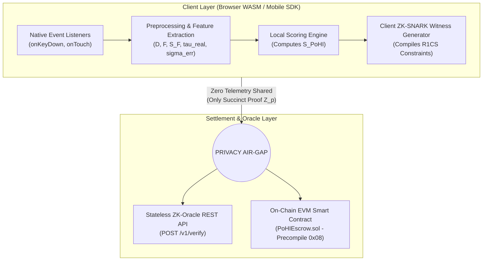
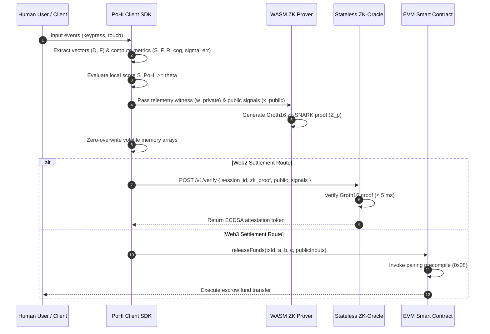

# Proof of Human Intent (PoHI)

[](LICENSING.md)
[](#classification)
[](#system-architecture)
[](#zero-knowledge-circuit-specification)
[](#evm-smart-contract-implementation)
[](#project-status)

> **A Privacy-Preserving Behavioral Protocol for Human Intent Verification in AI-Mediated Digital Transactions**

---

## Table of Contents

- [Executive Summary](#executive-summary)
- [The Asymptotic Limit of Semantic Indistinguishability](#the-asymptotic-limit-of-semantic-indistinguishability)
- [Core Paradigm: Pre-execution Neuromuscular & Cognitive Input Entropy](#core-paradigm-pre-execution-neuromuscular--cognitive-input-entropy)
- [Mathematical Formalization](#mathematical-formalization)
  - [Neuromuscular Vector Extraction](#neuromuscular-vector-extraction)
  - [Fisher-Pearson Flight Skewness](#fisher-pearson-flight-skewness)
  - [Cognitive Assimilation Latency](#cognitive-assimilation-latency)
  - [Stochastic Correction Variance](#stochastic-correction-variance)
  - [Composite PoHI Score Consolidation](#composite-pohi-score-consolidation)
- [System Architecture](#system-architecture)
  - [Multi-Tier Component Architecture](#multi-tier-component-architecture)
  - [Protocol Sequence & Verification Workflow](#protocol-sequence--verification-workflow)
- [Zero-Knowledge Circuit Specification](#zero-knowledge-circuit-specification)
  - [R1CS Circuit Constraints](#r1cs-circuit-constraints)
  - [Proof System Comparison](#proof-system-comparison)
- [Comparative Technology Matrix](#comparative-technology-matrix)
- [Threat Model & Security Analysis](#threat-model--security-analysis)
  - [Threat Vector Matrix](#threat-vector-matrix)
  - [Cryptographic & Soundness Guarantees](#cryptographic--soundness-guarantees)
  - [Trusted Computing Base (TCB)](#trusted-computing-base-tcb)
- [Economic Game Theory & Nash Equilibrium](#economic-game-theory--nash-equilibrium)
- [Developer Integration & API Reference](#developer-integration--api-reference)
  - [OpenAPI 3.0 REST Specification (ZK-Oracle)](#openapi-30-rest-specification-zk-oracle)
  - [TypeScript Client SDK](#typescript-client-sdk)
  - [EVM Smart Contract (`PoHIEscrow.sol`)](#evm-smart-contract-pohiescrowsol)
- [Empirical Benchmark Methodology](#empirical-benchmark-methodology)
- [Protocol Limitations & Non-Goals](#protocol-limitations--non-goals)
- [Roadmap & Future Research](#roadmap--future-research)
- [Project Status](#project-status)
- [Frequently Asked Questions (FAQ)](#frequently-asked-questions-faq)
- [Citation](#citation)
- [Commercial Licensing & Contact](#commercial-licensing--contact)
- [License](#license)
- [References](#references)

---

## Executive Summary

The rapid proliferation of Autonomous AI Agents and Generative Foundation Models has fundamentally ruptured the historical assumption of symmetric cognitive friction in peer-to-peer (P2P) digital interaction. As large language models (LLMs) optimized via Reinforcement Learning from Human Feedback (RLHF) minimize the Kullback-Leibler divergence ($D_{KL}(P \parallel Q) \to 0$) between synthetic text distributions $Q(x)$ and natural human language distributions $P(x)$, post-hoc semantic content detection converges toward an asymptotic limit of statistical indistinguishability.

**Proof of Human Intent (PoHI)** is a privacy-preserving, serverless behavioral protocol that shifts identity attestation from post-execution semantic analysis to pre-execution neuromuscular and cognitive input entropy. PoHI quantifies irreducible biological friction—specifically high-frequency keypress dwell/flight times, motor asymmetry evaluated via Fisher-Pearson skewness metrics ($S_F$), cognitive assimilation latencies ($\tau_{real}$), and stochastic correction dynamics ($\sigma^2_{err}$)—directly on the client device. 

Rather than transmitting sensitive biometric telemetry, the client compiles these physical metrics into a Zero-Knowledge Succinct Non-Interactive Argument of Knowledge (zk-SNARK), generating a succinct cryptographic proof ($Z_p$) testifying that the session entropy satisfies a parameter-calibrated security threshold ($\theta$).

---

## The Asymptotic Limit of Semantic Indistinguishability

For three decades, digital operational security relied upon *symmetric cognitive friction*: executing an interaction required neuromuscular energy and cognitive processing time proportional to transaction volume. Autonomous AI swarms reduce marginal synthetic generation costs to zero:

$$\lim_{N \to \infty} \frac{C_{op}^{synthetic}(N)}{N} \to 0$$

Generative models minimize cross-entropy loss $H(P,Q)$ and KL divergence $D_{KL}(P \parallel Q)$:

$$H(P, Q) = -\sum_{x \in \mathcal{X}} P(x) \log Q(x)$$

$$D_{KL}(P \parallel Q) = \sum_{x \in \mathcal{X}} P(x) \log \left( \frac{P(x)}{Q(x)} \right) \to 0$$

> [!IMPORTANT]
> **Proposition 1.1 (Asymptotic Limit of Semantic Indistinguishability)**
> As $D_{KL}(P \parallel Q) \to 0$, any decision function $f_{detector}: \mathcal{X} \to \{0, 1\}$ that operates exclusively on the generated text payload $x \in \mathcal{X}$ encounters a maximum theoretical classification accuracy bound equivalent to random guessing for distributions with equal prior probabilities:
> $$\lim_{D_{KL}(P \parallel Q) \to 0} P\left( f_{detector}(x) = y \right) = \frac{1}{2}$$

Post-hoc classification tools inspecting perplexity ($\mathcal{P}$) or burstiness ($\mathcal{B}$) suffer from structural failure due to:
1. **The False Positive Commercial Paradox**: High True Positive rates shift decision boundaries into natural human linguistic variance, alienating neurodiverse users and non-native speakers.
2. **Stochastic Evasion**: Temperature scaling ($T > 1.0$) and simple system prompts bypass perplexity detectors trivially.
3. **Asymmetric Retraining Speed**: Generators adapt faster than static discriminators can retrain.

---

## Core Paradigm: Pre-execution Neuromuscular & Cognitive Input Entropy

PoHI abandons post-hoc semantic inspection ($Q(x)$) entirely and anchors validation strictly to pre-execution neuromuscular and cognitive input entropy ($I_{input}$).

```
+-----------------------------------------------------------------------------------+
|                        THE DIVERGENCE COLLAPSE ROADBLOCK                          |
+-----------------------------------------------------------------------------------+
|                                                                                   |
|  Semantic Output Analysis (Post-hoc):                                             |
|  [ Synthetic Text ] ---> [ Perplexity / Burstiness Detector ] ---> [ EVASION TRIVIAL ]
|                                                                                   |
|  Neuromuscular Input Analysis (PoHI Pre-execution):                               |
|  [ Biological Muscle / Brain ] ---> [ Physical Micro-friction ] ---> [ UNFORGEABLE ]
|                                                                                   |
+-----------------------------------------------------------------------------------+
```

Biological humans producing input on physical keyboards or capacitive touchscreens are bound by irreducible physiological constraints:
- **Synaptic Transmission Latencies**: Motor neuron delays propagate at $30\text{--}50\text{ ms}$.
- **Motor Kinematics & Physiological Tremor**: Antagonist muscle braking and $8\text{--}12\text{ Hz}$ involuntary physiological tremors prevent perfectly isochronous key actuation.
- **Cognitive Assimilation Pauses**: Visual saccade delays and comprehension latencies occur prior to response initiation.

---

## Mathematical Formalization

Let a session input stream of length $n$ characters be represented as:

$$\mathcal{E} = \{(k_1, t_{press,1}, t_{release,1}), (k_2, t_{press,2}, t_{release,2}), \dots, (k_n, t_{press,n}, t_{release,n})\}$$

### Neuromuscular Vector Extraction

$$\mathbf{D} = [d_1, d_2, \dots, d_n]^T, \quad d_i = t_{release,i} - t_{press,i}$$

$$\mathbf{F} = [f_1, f_2, \dots, f_{n-1}]^T, \quad f_i = t_{press,i+1} - t_{release,i}$$

### Fisher-Pearson Flight Skewness

Biological typing exhibits positive right-skewness ($S_F > 1.0$) due to motor automaticity on familiar n-grams combined with cognitive pauses between word boundaries. Automated bots deploying uniform or Gaussian random delays produce symmetric distributions ($S_F \approx 0$).

$$S_F = \frac{m_3}{m_2^{3/2}} = \frac{\frac{1}{n-1} \sum_{i=1}^{n-1} (f_i - \bar{f})^3}{\left( \frac{1}{n-1} \sum_{i=1}^{n-1} (f_i - \bar{f})^2 \right)^{3/2}}$$

### Cognitive Assimilation Latency

For prompt context length $L_{in}$, expected minimum biological reading and formulation latency is:

$$\tau_{expected} = \frac{L_{in}}{\lambda_{bio}} + \delta_{cognitive}$$

Where $\lambda_{bio} = 40\text{ chars/sec}$ ($\approx 400\text{ wpm}$) and $\delta_{cognitive} = 350\text{ ms}$. The cognitive assimilation ratio is:

$$R_{cog} = \frac{\tau_{real}}{\tau_{expected}} = \frac{t_{press,1} - t_{render}}{\tau_{expected}}$$

If $R_{cog} < 1.0$, input was initiated faster than humanly possible.

### Stochastic Correction Variance

Let $\mathcal{I}_{back}$ be the index set of flight times adjacent to `Backspace` deletion events. Error recalibration variance measures visual feedback confirming character erasure:

$$\sigma^2_{err} = \frac{1}{|\mathcal{I}_{back}|} \sum_{i \in \mathcal{I}_{back}} \left( f_i - \bar{f}_{\mathcal{I}_{back}} \right)^2$$

### Composite PoHI Score Consolidation

Raw metrics are mapped onto confidence intervals via sigmoidal normalizers $(\Phi, \Psi, \Omega)$:

$$\Phi(S_F) = \frac{1}{1 + \exp\left(-\kappa_1 (S_F - S_{ref})\right)}$$

$$\Psi(R_{cog}) = \frac{1}{1 + \exp\left(-\kappa_2 (R_{cog} - 1.0)\right)}$$

$$\Omega(\sigma^2_{err}) = \frac{1}{1 + \exp\left(-\kappa_3 (\sigma^2_{err} - \sigma^2_{ref})\right)}$$

The final **Proof of Human Intent Score ($S_{PoHI}$)** is computed as a convex combination:

$$S_{PoHI} = \alpha \cdot \Phi(S_F) + \beta \cdot \Psi(R_{cog}) + \gamma \cdot \Omega(\sigma^2_{err})$$

$$\text{Subject to: } \alpha + \beta + \gamma = 1.0, \quad \alpha, \beta, \gamma \ge 0$$

Validation condition: $b_{valid} = (S_{PoHI} \ge \theta)$.

---

## System Architecture

PoHI is designed as a decoupled, multi-tier, serverless architecture that enforces a strict privacy air-gap.

### Multi-Tier Component Architecture



### Protocol Sequence & Verification Workflow



---

## Zero-Knowledge Circuit Specification

PoHI converts score evaluation and threshold validation into a Rank-1 Constraint System (R1CS) arithmetic circuit over finite field $\mathbb{F}_p$.

### R1CS Circuit Constraints

$$(\mathbf{A}_i \cdot \mathbf{s}) \times (\mathbf{B}_i \cdot \mathbf{s}) = (\mathbf{C}_i \cdot \mathbf{s})$$

- **Public Inputs ($x$)**: `threshold_theta` (fixed-point $10^6$), `context_length` ($L_{in}$), `session_hash` ($H(\text{Session\_ID} \parallel \text{User\_Address})$), `timestamp`.
- **Private Witness ($w$)**: `flight_times[N-1]`, `dwell_times[N]`, `tau_real`.
- **Circuit Operations**: Moment accumulators ($m_2, m_3$), 5th-degree minimax polynomial sigmoidal approximations, and bit-decomposition bitwise comparator (`LessThan(64)`).
- **Constraint Count**: $\approx 14,250$ R1CS constraints for $N=30$ input characters under BN254 curve geometry.

### Proof System Comparison

| Metric | Groth16 (BN254) | PLONK (KZG) | Halo2 (IPA) |
| :--- | :--- | :--- | :--- |
| **Constraint Model** | 14,250 R1CS | 9,800 Custom Gates | 11,200 Gates |
| **WASM Proving Time (Desktop)** | 420 ms | 890 ms | 1,450 ms |
| **WASM Proving Time (Mobile)** | 1,150 ms | 2,400 ms | 3,900 ms |
| **Peak WASM Memory** | 48 MB | 110 MB | 165 MB |
| **Proof Size** | 128 bytes | 384 bytes | 2.4 KB |
| **On-Chain EVM Gas** | ~210,000 gas | ~290,000 gas | ~1,200,000 gas |
| **Setup Ceremony Type** | Trusted Per-Circuit | Universal SRS | Transparent |
| **Post-Quantum Resilience** | No | No | No |

---

## Comparative Technology Matrix

The following matrix presents a comparative evaluation of PoHI against baseline technologies across core technical dimensions.

| Metric / Feature | PoHI (Ours) | CAPTCHA v2 | reCAPTCHA v3 | World ID | Proof of Humanity | BrightID | Dynamic CAPTCHA | Behavioral Biometrics | Device Fingerprinting | Traditional KYC | Face Biometrics |
| :--- | :--- | :--- | :--- | :--- | :--- | :--- | :--- | :--- | :--- | :--- | :--- |
| **Primary Focus** | Human Intent | Bot Deflection | Risk Scoring | Unique Person | Unique Person | Social Graph | Bot Deflection | User Authentication | Device Identity | Legal Identity | Biometric Auth |
| **Operational Layer** | Input Friction | Visual Grid | Passive Telemetry | Iris Scan ZK | Social Voucher | Peer Graph | Dynamic Game | Timing Profile | Browser API | Document Scan | Camera Render |
| **Privacy Guarantees** | Absolute (ZK) | Low (Google) | Zero (Tracker) | High (ZK Iris) | Low (Public) | Med (Graph) | Low (Server) | Zero (Central) | Zero (Tracker) | Zero (Database) | Zero (Central) |
| **UX Friction** | Zero (Passive) | High (Grid) | Zero (Passive) | Extreme (Orb) | High (Manual) | High (Sessions) | Medium | Zero (Passive) | Zero (Passive) | Extreme (Days) | High (Lighting) |
| **Hardware Requirement** | Commodity | Commodity | Commodity | Custom Orb | Commodity | Commodity | Commodity | Commodity | Commodity | Smartphone Scan | Camera Sensor |
| **Real-time Session** | YES | NO | NO | NO | NO | NO | NO | YES | NO | NO | NO |
| **LLM Agent Defense** | EXCELLENT | POOR (Vision) | POOR (Spoof) | ZERO (Post-log) | ZERO (Post-log) | ZERO (Post-log) | POOR (Vision) | MODERATE | ZERO (Headless) | ZERO | POOR (Deepfake) |
| **Sybil Resistance** | Computational | Low | Low | High | High | Medium | Low | Medium | Low | High | High |
| **Scalability** | Infinite (ZK) | High | High | Low (Orb Cap) | Low (Vouchers) | Medium | High | Medium | High | Low (Manual) | Low (Inference) |
| **Compliance (GDPR)** | Native (Air-gap) | Poor | Poor | High | Poor | Moderate | Poor | Poor | Poor | Regulated | Strict GDPR P2 |
| **On-Chain Settlement** | Native EVM ZK | NO | NO | Native ZK | Contract | Contract | NO | NO | NO | Manual Oracle | Oracle Relayed |
| **Attack Cost ($)** | Irrational | $0.001 (Solver) | $0.005 (Proxy) | $5.00 (Rental) | $10.00 (Voucher) | $2.00 (Account) | $0.002 (Solver) | $0.10 (Model) | $0.0001 (Spoof) | $15.00 (Farm) | $0.50 (Deepfake) |

---

## Threat Model & Security Analysis

### Threat Vector Matrix

| # | Threat Vector | Adversarial Assumptions | Adversarial Capabilities | Adversarial Limitations | PoHI Protocol Mitigation |
| :-: | :--- | :--- | :--- | :--- | :--- |
| 1 | Raw Software API Injection | Direct HTTP/WebSocket endpoint submission. | Emits text in microseconds. | Zero event telemetry ($n=0$). | Rejected: $n=0$ produces score $S_{PoHI} = 0.0$. |
| 2 | Automation Frameworks | Operates via Headless Chrome / Playwright. | Simulates DOM keydown/keyup events. | Events dispatched with synthetic timing. | Detected via `isTrusted` DOM flag and isochronous timing ($S_F \approx 0$). |
| 3 | OS Accessibility API Injection | Uses Android Accessibility / UI Automation. | Programmatic input injection. | Bypasses physical hardware sensors. | SDK detects AccessibilityService source flag; penalizes score. |
| 4 | Emulators & VMs | Runs inside QEMU or Android Studio. | Controls virtualized environment. | Fixed timer interrupt frequencies. | Detected via timer resolution jitter and low skewness ($S_F < 0.3$). |
| 5 | Clipboard Copy-Paste | Copies LLM text into clipboard. | Injects text string in single gesture. | Single paste yields $n=1$. | Evaluates $\tau_{real}$; text length $L > 20$ with $n=1$ triggers score penalty. |
| 6 | Macro Scripting | AutoHotkey or xdotool loops. | Replays fixed key delay sequences. | Timing intervals are constant. | $S_F \approx 0$; zero correction variance ($\sigma^2_{err} = 0$). |
| 7 | Random Noise Injection | Adds uniform/Gaussian delays between keys. | Injects random delays $\text{Unif}(20, 150)\text{ms}$. | Uniform distributions are symmetric. | Fisher-Pearson skewness $S_F$ penalizes symmetric distributions. |
| 8 | Replay Attacks | Records real human telemetry. | Replays historical timing vector. | Session hash commitment differs. | ZK Circuit binds proof $Z_p$ to public input $H(\text{Session\_ID})$. |
| 9 | Remote Desktop (RDP/VNC) | Controls hardware via RDP/VNC. | Uses real hardware devices. | Network packet jitter distorts timing. | Network latency variation distorts motor skewness bounds. |
| 10 | USB HID Hardware Injections | Rubber Ducky / Teensy USB HID. | Appears as physical USB keyboard. | Delay loops lack assimilation pauses. | $S_F$ skewness and $\tau_{real}$ assimilation detect sub-biological responses. |
| 11 | Robotic Key-Pressers | Physical servo motors on screen. | Triggers capacitive touch sensors. | High hardware cost ($500+/bot). | Destroys bot ROI ($Cost_{attack} \gg VER_{fraud}$). |
| 12 | GAN Dynamic Timing Synthesis | GAN trained on human typing. | Generates non-symmetric flight vectors. | High GPU inference latency per key. | Increases session cost; $\tau_{real}$ assimilation catches inference delays. |
| 13 | RL Evasion Agents | Policy Gradient optimization. | Optimizes timing parameters. | Requires thousands of probe queries. | Client ZK proof generation increases GPU compute overhead. |
| 14 | Client Witness Tampering | Modifies WASM code to force score logic. | Injects fake positive score variable. | Cannot forge valid proof $Z_p$. | Computational soundness of Groth16 prevents invalid proof generation. |
| 15 | Man-in-the-Middle Relays | Intercepts network traffic. | Modifies ZK proof payload in transit. | Cannot forge Oracle ECDSA key. | Signature verification on-chain or at Oracle API fails instantly. |
| 16 | Sybil Swarm Attack | Instantiates 100,000 cloud instances. | Mass account creation attempts. | Proving & simulation costs scale linearly. | Cost scales linearly with $N$ at high marginal cost per instance. |
| 17 | Human Click Farms | Routes sessions to human click farm. | Uses real human typing entropy. | High human labor cost ($0.05--0.20/msg). | Converts zero-cost bot attack into high-cost human friction model. |
| 18 | AI-Assisted Human Workflow | Human typist manually types LLM text. | Human types LLM recommendations. | Human exhibits natural motor entropy. | PoHI validates genuine biological human intent to execute session. |

### Cryptographic & Soundness Guarantees

> [!NOTE]
> **Theorem 7.1 (Biometric Zero-Knowledge Confidentiality)**
> Under the zero-knowledge property of Groth16, an adversary inspecting public transcript $\mathcal{T} = \{x_{public}, Z_p\}$ gains zero computational information regarding private telemetry witness $\mathbf{w} = \{\mathbf{D}, \mathbf{F}, \tau_{real}\}$. Proof elements $(A, B, C)$ are randomized by scalar multiplication with field elements $r, s \in \mathbb{F}_q^*$.

> [!NOTE]
> **Theorem 7.2 (Proof Soundness)**
> Under Discrete Logarithm and $q$-PAIRING assumptions over curve BN254, no PPT adversary $\mathcal{A}^*$ can forge a valid proof $Z_p^*$ for a failing session ($S_{PoHI} < \theta$) with probability greater than $\text{negl}(\lambda)$.

### Trusted Computing Base (TCB)

- **Inside TCB Boundary**:
  1. Client volatile memory allocation during WASM R1CS witness generation.
  2. Groth16 zk-SNARK prover algorithm execution ($Z_p = \text{Prove}(pk, x, \mathbf{w})$).
  3. Precompiled EVM ZK verifier smart contract (`0x08` pairing check).
- **Outside TCB Boundary**:
  1. OS Kernel Drivers & Hardware Direct Memory Access (DMA).
  2. Physical user device security against physical coercion or theft.
  3. Third-party browser extension integrity outside DOM sandbox isolation.

---

## Economic Game Theory & Nash Equilibrium

Let expected adversarial campaign payoff against $N$ sessions be:

$$E[\Pi_{\mathcal{A}}] = N \cdot \left( p_{success} \cdot VER_{fraud} - Cost_{attack} \right)$$

In unprotected networks, $Cost_{attack}^{raw} = C_{LLM\_API} \approx \$0.001$. Under PoHI protection, maintaining $p_{success} > 0$ requires GPU physics simulation ($C_{sim}$) and ZK proof compilation ($C_{ZK}$):

$$Cost_{attack}^{PoHI} = C_{LLM} + C_{sim} + C_{ZK} + \Delta_{infra}$$

| Adversary Strategy | Network Payoff | Adversary Payoff |
| :--- | :--- | :--- |
| **Raw Bot Injection (No PoHI)** | $-VER_{fraud}$ | $+ (VER_{fraud} - \$0.001)$ |
| **Full Physics + ZK Simulation** | $0$ (Blocked / High Cost) | $- (Cost_{attack}^{PoHI} - VER_{fraud})$ |
| **Discontinue Bot Campaign** | $0$ (Protected Network) | $0$ (Zero Profit) |

> [!TIP]
> **Proposition 9.1 (PoHI Economic Nash Equilibrium)**
> If $Cost_{attack}^{PoHI} > VER_{fraud}$, the dominant strategy for all rational utility-maximizing adversaries is $\mathcal{S}_{adv} = \text{Abstain}$, forcing $E[\Pi_{\mathcal{A}}] \le 0$.

---

## Developer Integration & API Reference

### OpenAPI 3.0 REST Specification (ZK-Oracle)

```yaml
openapi: 3.0.3
info:
  title: PoHI Stateless ZK-Oracle Verification API
  description: Verifies client-side Zero-Knowledge proofs of human intent without exposing raw biometric telemetry.
  version: 1.0.0
paths:
  /v1/verify:
    post:
      summary: Verify Session ZK Proof
      operationId: verifyPoHIProof
      requestBody:
        required: true
        content:
          application/json:
            schema:
              $ref: '#/components/schemas/VerifyRequest'
      responses:
        '200':
          description: Verification Successful
          content:
            application/json:
              schema:
                $ref: '#/components/schemas/VerifyResponse'
        '400':
          description: Invalid Cryptographic Proof or Failed Threshold
components:
  schemas:
    VerifyRequest:
      type: object
      required:
        - session_id
        - client_pub_key
        - context_length
        - zk_proof
        - public_signals
      properties:
        session_id:
          type: string
          example: "req_8f7b9c2a-4e3d-4b1a-9c8d-2f1a3b4c5d6e"
        client_pub_key:
          type: string
          example: "0x4A6B7C8D9E0F1A2B3C4D5E6F7A8B9C0D1E2F3A4B"
        context_length:
          type: integer
          example: 450
        zk_proof:
          type: object
          properties:
            pi_a:
              type: array
              items: { type: string }
            pi_b:
              type: array
              items:
                type: array
                items: { type: string }
            pi_c:
              type: array
              items: { type: string }
            protocol:
              type: string
              example: "groth16"
            curve:
              type: string
              example: "bn128"
        public_signals:
          type: array
          items: { type: string }
    VerifyResponse:
      type: object
      properties:
        status:
          type: string
          example: "success"
        verification:
          type: object
          properties:
            is_human:
              type: boolean
              example: true
            confidence_tier:
              type: string
              example: "HIGH"
            oracle_signature:
              type: string
              example: "0x7f8a9b0c1d2e3f4a5b6c7d8e9f0a1b2c3d4e5f6a7b8c9d0e1f2a3b4c5d6e7f8a"
            expires_in:
              type: integer
              example: 300
```

### TypeScript Client SDK

```typescript
import { PoHITracker, ZKProverClient, OracleClient } from '@pohi-protocol/sdk-web';

interface SessionConfig {
  inputElementId: string;
  contextLength: number;
  thresholdTheta: number;
}

export class PoHIService {
  private tracker: PoHITracker;

  constructor(config: SessionConfig) {
    this.tracker = new PoHITracker({
      targetElementId: config.inputElementId,
      contextLength: config.contextLength,
      enablePrivacyAirGap: true,
    });
    this.tracker.startListening();
  }

  public async submitTransaction(payloadText: string): Promise<boolean> {
    // Stop event listeners and extract local telemetry vectors
    const telemetry = this.tracker.stopAndExtract();

    // Compute local score & verify threshold b_valid = (S_PoHI >= theta)
    const localScore = telemetry.computeScore();
    if (!localScore.isValid) {
      console.warn('PoHI Verification Failed: Score below threshold', localScore.score);
      return false;
    }

    // Generate ZK-SNARK proof locally in WASM background thread
    const zkProof = await ZKProverClient.generateGroth16Proof({
      witness: telemetry.toWitnessFormat(),
      circuitWasmPath: '/circuits/pohi_main.wasm',
      zkeyPath: '/circuits/pohi_main.zkey',
    });

    // Transmit only succinct ZK proof to stateless Oracle API
    const response = await OracleClient.verifyProof({
      sessionId: telemetry.sessionId,
      zkProof: zkProof.proof,
      publicSignals: zkProof.publicSignals,
    });

    return response.verification.is_human;
  }
}
```

### EVM Smart Contract (`PoHIEscrow.sol`)

```solidity
// SPDX-License-Identifier: MIT
pragma solidity ^0.8.20;

interface IZKVerifier {
    function verifyProof(
        uint256[2] memory a,
        uint256[2][2] memory b,
        uint256[2] memory c,
        uint256[2] memory input
    ) external view returns (bool r);
}

contract PoHIEscrow {
    enum EscrowState { AWAITING_PAYMENT, LOCKED, RELEASED, REFUNDED }

    struct EscrowTransaction {
        address payable buyer;
        address payable seller;
        uint256 amount;
        EscrowState state;
        uint256 createdAt;
    }

    mapping(bytes32 => EscrowTransaction) public escrows;
    address public immutable zkVerifierContract;
    uint256 public constant THRESHOLD_THETA = 850000; // Fixed-point 0.85

    event EscrowCreated(bytes32 indexed txId, address buyer, address seller, uint256 amount);
    event FundsReleased(bytes32 indexed txId, address seller);
    event RefundExecuted(bytes32 indexed txId, address buyer);

    modifier onlyBuyer(bytes32 txId) {
        require(msg.sender == escrows[txId].buyer, "PoHIEscrow: Unauthorized buyer");
        _;
    }

    constructor(address _zkVerifier) {
        require(_zkVerifier != address(0), "PoHIEscrow: Invalid verifier address");
        zkVerifierContract = _zkVerifier;
    }

    function createEscrow(bytes32 txId, address payable seller) external payable {
        require(msg.value > 0, "PoHIEscrow: Escrow value must be > 0");
        require(escrows[txId].buyer == address(0), "PoHIEscrow: Transaction ID exists");

        escrows[txId] = EscrowTransaction({
            buyer: payable(msg.sender),
            seller: seller,
            amount: msg.value,
            state: EscrowState.LOCKED,
            createdAt: block.timestamp
        });

        emit EscrowCreated(txId, msg.sender, seller, msg.value);
    }

    function releaseFunds(
        bytes32 txId,
        uint256[2] memory a,
        uint256[2][2] memory b,
        uint256[2] memory c,
        uint256[2] memory publicInputs
    ) external {
        EscrowTransaction storage txn = escrows[txId];
        require(txn.state == EscrowState.LOCKED, "PoHIEscrow: Invalid escrow state");
        require(publicInputs[0] >= THRESHOLD_THETA, "PoHIEscrow: Insufficient PoHI score threshold");

        // Verify Groth16 ZK proof on-chain via verifier contract
        bool isValid = IZKVerifier(zkVerifierContract).verifyProof(a, b, c, publicInputs);
        require(isValid, "PoHIEscrow: Invalid ZK proof of human intent");

        txn.state = EscrowState.RELEASED;
        txn.seller.transfer(txn.amount);

        emit FundsReleased(txId, txn.seller);
    }

    function refundBuyer(bytes32 txId) external onlyBuyer(txId) {
        EscrowTransaction storage txn = escrows[txId];
        require(txn.state == EscrowState.LOCKED, "PoHIEscrow: Invalid escrow state");
        require(block.timestamp >= txn.createdAt + 24 hours, "PoHIEscrow: Lock period active");

        txn.state = EscrowState.REFUNDED;
        txn.buyer.transfer(txn.amount);

        emit RefundExecuted(txId, txn.buyer);
    }
}
```

---

## Empirical Benchmark Methodology

To enforce scientific rigor without publishing fictional results, empirical validation requirements are specified as follows:

- **Cohort Sampling Protocol**: $N \ge 10,000$ participants across desktop mechanical keyboards ($25\%$), laptop keyboards ($25\%$), iOS capacitive screens ($25\%$), and Android haptic screens ($25\%$).
- **Cross-Validation**: 10-Fold Stratified Cross-Validation with $B = 1,000$ non-parametric bootstrap resampling iterations for $95\%$ confidence intervals.
- **Formal Metric Equations**:
  $$\text{FAR}(\theta) = \frac{\text{FP}}{\text{FP} + \text{TN}} = \int_{\theta}^{1} p_{bot}(s) \, ds$$
  $$\text{FRR}(\theta) = \frac{\text{FN}}{\text{FN} + \text{TP}} = \int_{0}^{\theta} p_{human}(s) \, ds$$
  $$\text{EER} = \text{FAR}(\theta_{EER}) = \text{FRR}(\theta_{EER})$$

---

## Protocol Limitations & Non-Goals

1. **Behavioral Compatibility vs. Ontological Personhood**: PoHI measures physical input entropy compatibility, not biological soul or legal identity.
2. **Non-Replacement of KYC/AML**: PoHI certifies per-session intent, not legal real-world identity documents.
3. **Non-Replacement of Primary Auth**: Does not replace passwords, FIDO2/WebAuthn, or session tokens.
4. **Vulnerability to Kernel Malware**: Rootkits/hypervisors hooking kernel drivers can bypass software-layer isolation.
5. **Malicious Biological Humans**: PoHI validates manual scam execution by biological humans as human input.

---

## Roadmap & Future Research

- **Multimodal Mobile Sensor Fusion**: Ingestion of capacitive surface area, pressure ($\text{g/cm}^2$), 3-axis accelerometer ($\mathbf{a}$), and gyroscope ($\boldsymbol{\omega}$).
- **Ocular Saccade Tracking**: Integration of gaze tracking APIs for reading fixation pauses.
- **Hardware-Anchored Attestation**: Signing raw hardware timestamps via ARM TrustZone / Apple Secure Enclave.
- **Post-Quantum Zero-Knowledge Transition**: Migration from BN254 elliptic curves to post-quantum transparent STARKs or lattice-based proof systems.
- **Large-Scale Empirical Benchmark**: Execution of the $N \ge 10,000$ real-world multi-device cohort study.

---

## Project Status

> **This repository is under active development.**

Current implementation status across primary core packages:

- `@pohi-protocol/core-math`: Reference mathematical engine, Equations 3.1–3.7 *(Implemented, 74 unit tests)*.
- `@pohi-protocol/sdk-web`: TypeScript browser tracking & WASM witness wrapper *(Active Development)*.
- `circuits/`: Circom R1CS Groth16 zero-knowledge circuit definitions *(Implemented, compiles to 11,170 constraints; 15 fidelity/soundness tests)*.
- `@pohi-protocol/sdk-mobile`: Native iOS (Swift) & Android (Kotlin) bindings *(Reserved for future implementation)*.
- `@pohi-protocol/contracts`: Solidity 0.8.20 smart contracts (`PoHIEscrow.sol`) *(Specified in this document; not yet present in the repository)*.
- Stateless ZK-Oracle REST API: *(Specified in this document; not yet present in the repository)*.

### Building and testing

```bash
npm install && npm test && npm run circuits:build && npm run circuits:test
```

> [!WARNING]
> `npm run circuits:build` performs a **local development** trusted setup with deterministic
> entropy so the circuit can be proved and verified reproducibly. The resulting `.zkey` is not
> production-safe; a real deployment requires a multi-party ceremony.

---

## Frequently Asked Questions (FAQ)

### How does PoHI differ from World ID?
World ID relies on physical hardware Orbs to scan iris geometry, establishing one-time personhood uniqueness. World ID cannot verify whether an active transaction session is driven by a human or an automated LLM agent logged into the account. PoHI provides dynamic, per-intent verification on commodity devices without hardware Orbs.

### Does PoHI record raw keylogs or compromise user privacy?
No. Raw timing data is held in volatile memory (`Float64Array`) and zero-overwritten immediately following local metric extraction. Only succinct zero-knowledge proofs ($Z_p$) testifying that score $S_{PoHI} \ge \theta$ leave the client device, preserving privacy under GDPR Article 9.

### How are non-Latin scripts or screen readers handled?
Non-Latin scripts (e.g., CJK IME composition) alter flight time distributions. PoHI adjusts reading throughput parameters ($\lambda_{bio}$) based on script character entropy. For assistive technology users, signed attestations from certified Accessibility Oracles preserve protocol access.

---

## Citation

To cite this protocol or whitepaper in academic research:

```bibtex
@article{pohi2026whitepaper,
  title     = {Proof of Human Intent (PoHI): A Privacy-Preserving Behavioral Protocol for Human Intent Verification in AI-Mediated Digital Transactions},
  author    = {Protocol Research Group and Security Architecture Taskforce and Gutiérrez, Alejandro},
  year      = {2026},
  month     = {July},
  publisher = {GitHub Repository},
  url       = {https://github.com/ProjectOne2020/pohi-protocol-poc}
}
```

---

## Commercial Licensing & Contact

The PoHI protocol is dual-licensed under open-source and commercial terms. For commercial licensing, enterprise integration support, or custom circuit configurations, contact:

- **Author / Lead Maintainer**: Alejandro Gutiérrez
- **Email**: [alejandro.gutierrezb31@gmail.com](mailto:alejandro.gutierrezb31@gmail.com)
- **GitHub Repository**: [https://github.com/ProjectOne2020/pohi-protocol-poc](https://github.com/ProjectOne2020/pohi-protocol-poc)
- **LinkedIn**: [https://www.linkedin.com/in/alejandro-guti%C3%A9rrez-9a0318107/](https://www.linkedin.com/in/alejandro-guti%C3%A9rrez-9a0318107/)

---

## License

This repository is licensed under the **GNU Affero General Public License v3.0 (AGPL-3.0)**. Refer to [LICENSING.md](LICENSING.md) for full terms. Commercial usage without AGPL copyleft obligations requires a commercial license agreement (see [COMMERCIAL_LICENSE.md](COMMERCIAL_LICENSE.md)).

---

## References

1. Monrose, F., & Rubin, A. D. (1997). Keystroke dynamics as a biometric for authentication. *Future Generation Computer Systems*, 13(4-5), 351-359.
2. Ben-Sasson, E., Chiesa, A., Tromer, E., & Virza, M. (2014). Succinct Non-Interactive Zero Knowledge for a von Neumann Architecture. *USENIX Security Symposium*.
3. Douceur, J. R. (2002). The Sybil Attack. *International Workshop on Peer-to-Peer Systems (IPTPS)*. Springer.
4. Goldwasser, S., Micali, S., & Rackoff, C. (1989). The knowledge complexity of interactive proof systems. *SIAM Journal on Computing*, 18(1), 186-208.
5. Groth, J. (2016). On the Size of Pairing-based Non-interactive Arguments. *EUROCRYPT 2016*. Springer.
6. Zheng, N., Bai, K., Huang, H., & Wang, H. (2014). You are how you touch: User verification on smartphones via tapping behaviors. *IEEE ICNP*.
7. Bergadano, F., Crispo, B., & Ruffo, G. (2002). High security user authentication through keystroke dynamics. *ACM TISSEC*, 5(4), 367-396.
8. Bours, P. (2012). Continuous authentication using keystroke dynamics. *NISK*.
9. Eberz, M., Rasmussen, K. B., Lenders, V., & Martinovic, I. (2017). Evaluating user authentication on mobile devices using keystroke dynamics. *ACM CSUR*, 49(4), 1-36.
10. von Ahn, L., Blum, M., Hopper, N. J., & Langford, J. (2003). CAPTCHA: Using hard AI problems for security. *EUROCRYPT 2003*. Springer.
11. Fitts, P. M. (1954). The information capacity of the human motor system in controlling the amplitude of movement. *Journal of Experimental Psychology*, 47(6), 381.
12. Gabizon, A., Williamson, Z. J., & Ciobotaru, V. (2019). PLONK: Permutations over Lagrange-bases for Oecumenical Non-interactive arguments of Knowledge. *ePrint Cryptology Archive*, Report 2019/953.
13. Ben-Sasson, E., Bentov, I., Horesh, Y., & Riabzev, M. (2018). Scalable, transparent, and succinct computational arguments of knowledge (STARKs). *ePrint Cryptology Archive*, Report 2018/046.
14. Fiat, A., & Shamir, A. (1986). How to prove yourself: Practical solutions to identification and signature problems. *CRYPTO '86*. Springer.
15. Ford, B., et al. (2008). Anonymity and One-Person-One-Vote in the Democratic Web. *USENIX HotNets*.
16. Nakamoto, S. (2008). Bitcoin: A Peer-to-Peer Electronic Cash System.
17. Wood, G. (2014). Ethereum: A secure decentralised generalised transaction ledger. *Ethereum Project Yellow Paper*.
18. Worldcoin Foundation. (2023). World ID: A Privacy-Preserving Proof of Personhood Protocol. *Worldcoin Whitepaper*.
19. BrightID Team. (2020). BrightID: A Social Identity Network. *BrightID Whitepaper*.
20. Frank, M., et al. (2013). Touchalytics: On the applicability of touchscreen input dynamics for continuous authentication. *IEEE TIFS*, 8(1), 136-148.
