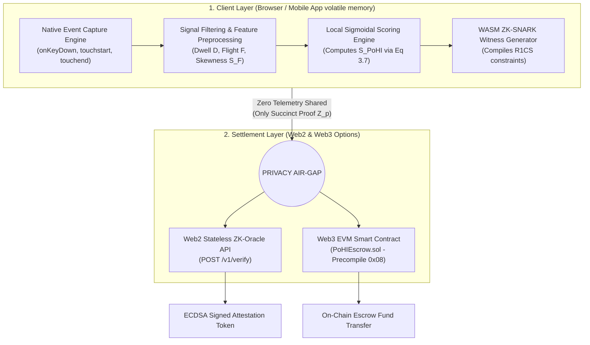
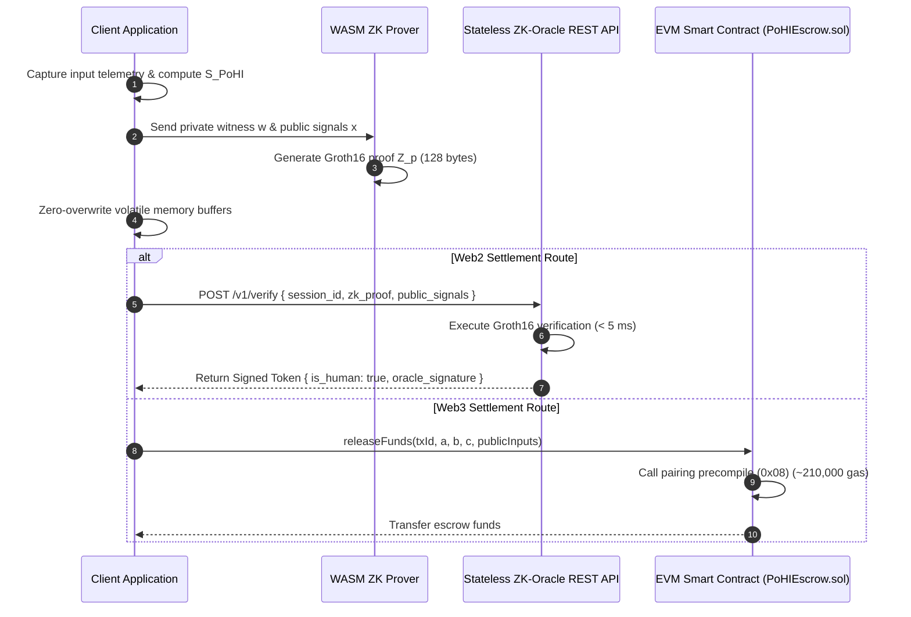

# System Architecture Specification

This document details the multi-tier system architecture of the **Proof of Human Intent (PoHI)** protocol. PoHI is engineered as a serverless, decoupled behavioral verification framework designed to enforce a strict privacy air-gap between client telemetry capture and settlement verification.

---

## 1. Architectural Overview & System Tiers

PoHI separates execution into three distinct layers: the **Client Processing Layer**, the **Privacy Air-Gap Boundary**, and the **Settlement & Oracle Layer**.

---

## 2. Component Subsystem Breakdown

### 2.1 Client Layer & Monitored Event SDK

The Client Layer executes entirely within the volatile memory space of the user's web browser (`@pohi-protocol/sdk-web`) or native mobile runtime (`@pohi-protocol/sdk-mobile` *[Reserved for future implementation]*).

1. **Event Capture Engine**: Registers native high-precision listeners for `keydown`, `keyup`, `touchstart`, and `touchend` events on target input elements.
2. **Volatile Buffer Security**: Raw event timestamps ($t_{press}, t_{release}$) are held strictly in volatile typed arrays (`Float64Array`).
3. **Zero-Overwrite Sanitization**: Immediately following metric extraction and witness compilation, raw telemetry buffers are zero-overwritten in memory to prevent keylogging or side-channel memory inspection.

### 2.2 Feature Preprocessing Pipeline

1. **Signal Filtering**: Filters out synthetic autorepeat events (e.g., physical key hold-down producing $d_i \approx 0$).
2. **Vector Construction**: Constructs Dwell Vector $\mathbf{D} \in \mathbb{R}^n$ and Flight Vector $\mathbf{F} \in \mathbb{R}^{n-1}$.
3. **Statistical Extraction**: Calculates Fisher-Pearson skewness ($S_F$), cognitive assimilation ratio ($R_{cog}$), and error recalibration variance ($\sigma^2_{err}$).

### 2.3 Local Normalization & Scoring Engine

Applies continuous sigmoidal normalizers $(\Phi, \Psi, \Omega)$ to compute composite scalar $S_{PoHI} \in [0, 1]$:

$$S_{PoHI} = \alpha \cdot \Phi(S_F) + \beta \cdot \Psi(R_{cog}) + \gamma \cdot \Omega(\sigma^2_{err})$$

Evaluates local validity assertion: $b_{valid} = (S_{PoHI} \ge \theta)$.

### 2.4 ZK Circuit Generation Pipeline

If $b_{valid} = 1$, the client invokes its WebAssembly-compiled ZK prover (`snarkjs` / `halo2-wasm`). The prover compiles private telemetry vectors as witness $w$ and outputs a succinct Groth16 proof $Z_p$:

$$Z_p = \text{Prove}(pk, x_{public}, w_{private})$$

Proof size under Groth16 / BN254 is **128 bytes**, ensuring minimal network transmission overhead.

---

## 3. Settlement & Verification Layer

PoHI supports two decoupled settlement interfaces:

### 3.1 Web2 Stateless ZK-Oracle API
Receives proof payload $Z_p$ and public signals $x_{public}$, verifies proof validity in $< 5\text{ ms}$, and returns an ECDSA-signed attestation token.

### 3.2 Web3 On-Chain EVM Smart Contract (`PoHIEscrow.sol`)
Submits proof $Z_p$ to Solidity smart contract. Verifies Groth16 proof directly on-chain using Ethereum's native alt_bn128 pairing precompile at address `0x08` (~210,000 gas).

---

## 4. Repository Package Structure

| Package / Directory | Description | Implementation Status |
| :--- | :--- | :--- |
| `circuits/` | Circom R1CS Groth16 zero-knowledge circuit definitions | Active Development |
| `@pohi-protocol/sdk-web` | TypeScript browser event tracking & WASM witness wrapper | Active Development |
| `@pohi-protocol/sdk-mobile` | Native iOS (Swift) & Android (Kotlin) tracking bindings | Reserved for future implementation |
| `@pohi-protocol/contracts` | Solidity 0.8.20 smart contracts (`PoHIEscrow.sol`) | Active Development |
| `docs/` | Architectural specs, threat models, and mathematical papers | Active Development |

---

## 5. Architectural References

- For execution sequence workflows, see [PROTOCOL.md](PROTOCOL.md).
- For R1CS constraint specifications, see [CRYPTOGRAPHY.md](CRYPTOGRAPHY.md).
- For formal threat vector analyses, see [THREAT_MODEL.md](THREAT_MODEL.md).
