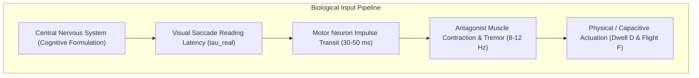

# Mathematical & Biomechanical Behavioral Model Specification

This document details the mathematical formalization, biomechanical motor control principles, and feature normalization equations underlying the **Proof of Human Intent (PoHI)** protocol, based on Chapters 1, 2, 3, and 9 of the research whitepaper.

---

## 1. Biomechanical & Neurological Foundations

Human-Computer Interaction (HCI) and motor control neuroscience establish that biological text production is subject to irreducible physiological constraints that software synthesis cannot replicate without high-fidelity physics simulation.

### 1.1 Fitts's Law & Ballistic Submovements
Target acquisition and key actuation follow Fitts's Law (Fitts, 1954):

$$MT = a + b \log_2 \left( \frac{2D}{W} \right) = a + b \cdot ID$$

When a human typist moves a finger toward a target key, velocity $v(t)$ displays an asymmetric bell curve composed of:
1. **Primary Submovement**: High-velocity agonist muscle acceleration impulse.
2. **Secondary Deceleration Phase**: Closed-loop feedback adjustments driven by visual feedback and antagonist muscle braking, producing high-frequency micro-adjustments.

### 1.2 Physiological Tremor & Co-Articulation
- **Physiological Tremor**: Involuntary oscillation ($8\text{--}12\text{ Hz}$) caused by central nervous system pacemaker loops.
- **Micro-Coarticulation**: The motion of finger $i$ is physically influenced by finger $i+1$ due to shared tendon structures in the forearm (*flexor digitorum profundus*).

---

## 2. Complete Mathematical Formulation

Let a session input stream of length $n$ characters be represented as:

$$\mathcal{E} = \{(k_1, t_{press,1}, t_{release,1}), (k_2, t_{press,2}, t_{release,2}), \dots, (k_n, t_{press,n}, t_{release,n})\}$$

### 2.1 Equation 3.1: Neuromuscular Vector Extraction
$$\mathbf{D} = [d_1, d_2, \dots, d_n]^T, \quad d_i = t_{release,i} - t_{press,i}$$

$$\mathbf{F} = [f_1, f_2, \dots, f_{n-1}]^T, \quad f_i = t_{press,i+1} - t_{release,i}$$

- **Physical Meaning**: Dwell time ($d_i$) reflects finger depression elasticity and local keycap mechanics; flight time ($f_i$) reflects inter-finger transit speed and motor planning.

### 2.2 Equation 3.2: Fisher-Pearson Flight Skewness
Biological typing exhibits positive right-skewness ($S_F > 1.0$) due to motor automaticity on familiar n-grams combined with cognitive pauses between word boundaries. Automated bots deploying uniform or Gaussian random delays produce symmetric distributions ($S_F \approx 0$).

$$S_F = \frac{m_3}{m_2^{3/2}} = \frac{\frac{1}{n-1} \sum_{i=1}^{n-1} (f_i - \bar{f})^3}{\left( \frac{1}{n-1} \sum_{i=1}^{n-1} (f_i - \bar{f})^2 \right)^{3/2}}$$

Where:
$$\bar{f} = \frac{1}{n-1} \sum_{i=1}^{n-1} f_i$$

### 2.3 Equations 3.3 & 3.4: Cognitive Assimilation Latency
Expected biological assimilation latency for prompt context length $L_{in}$:

$$\tau_{expected} = \frac{L_{in}}{\lambda_{bio}} + \delta_{cognitive}$$

Where $\lambda_{bio} = 40\text{ chars/sec}$ ($\approx 400\text{ wpm}$) and $\delta_{cognitive} = 350\text{ ms}$.

The non-dimensional **Cognitive Assimilation Ratio ($R_{cog}$)** is:

$$R_{cog} = \frac{\tau_{real}}{\tau_{expected}} = \frac{t_{press,1} - t_{render}}{\tau_{expected}}$$

If $R_{cog} < 1.0$, the client initiated a response faster than humanly possible given context volume.

### 2.4 Equation 3.5: Stochastic Correction Variance
Let $\mathcal{I}_{back}$ be the index set of flight times adjacent to `Backspace` deletion events. Error recalibration variance measures visual feedback confirming character erasure:

$$\sigma^2_{err} = \frac{1}{|\mathcal{I}_{back}|} \sum_{i \in \mathcal{I}_{back}} \left( f_i - \bar{f}_{\mathcal{I}_{back}} \right)^2$$

### 2.5 Equations 3.6 & 3.7: Sigmoidal Normalization & Composite Score
Raw metrics map onto confidence intervals via sigmoidal normalizers $(\Phi, \Psi, \Omega)$:

$$\Phi(S_F) = \frac{1}{1 + \exp\left(-\kappa_1 (S_F - S_{ref})\right)}$$

$$\Psi(R_{cog}) = \frac{1}{1 + \exp\left(-\kappa_2 (R_{cog} - 1.0)\right)}$$

$$\Omega(\sigma^2_{err}) = \frac{1}{1 + \exp\left(-\kappa_3 (\sigma^2_{err} - \sigma^2_{ref})\right)}$$

The final **Proof of Human Intent Score ($S_{PoHI}$)** is computed as:

$$S_{PoHI} = \alpha \cdot \Phi(S_F) + \beta \cdot \Psi(R_{cog}) + \gamma \cdot \Omega(\sigma^2_{err})$$

$$\text{Subject to: } \alpha + \beta + \gamma = 1.0, \quad \alpha, \beta, \gamma \ge 0$$

Validation assertion: $b_{valid} = (S_{PoHI} \ge \theta)$.

---

## 3. Domain Parameter Calibration Matrix

Parameters $(\alpha, \beta, \gamma)$ and security threshold $\theta$ are calibrated according to domain risk profiles:

| Implementation Domain | Alpha ($\alpha$ - Motor $S_F$) | Beta ($\beta$ - Cogn. $\tau$) | Gamma ($\gamma$ - Error $\sigma^2$) | Threshold ($\theta$) | UX / Risk Target |
| :--- | :--- | :--- | :--- | :--- | :--- |
| **P2P Financial Escrow** | 0.30 | 0.50 | 0.20 | 0.85 | High Security |
| **B2B Merchant Messaging**| 0.40 | 0.40 | 0.20 | 0.75 | Balanced |
| **Gaming Guild Chat** | 0.70 | 0.15 | 0.15 | 0.60 | Low Latency |
| **Public Community Forum**| 0.50 | 0.25 | 0.25 | 0.55 | High Fluidity |

---

## 4. Mathematical Equation Audit Matrix (v5.0 Program Committee Audit)

Every equation within the PoHI mathematical model is evaluated against eight explicit scientific criteria:

1. **Formal Definition**: Symbolic mapping from private telemetry witness space $\mathcal{W}$ to normalized feature domain $\boldsymbol{\theta}_{feat} \in [0, 1]^3$.
2. **Operational Assumptions**: Assumes client OS input driver timestamp accuracy ($\pm 1\text{ ms}$) without event queue tampering.
3. **Variable & Unit Specifications**: $d_i, f_i \in \mathbb{R}^+$ in milliseconds; $L_{in} \in \mathbb{N}^+$ in character counts; $S_F, R_{cog}, S_{PoHI}$ as non-dimensional scalars.
4. **Physical Biomechanical Interpretation**: Maps antagonist muscle co-contraction, physiological tremor ($8\text{--}12\text{ Hz}$), and visual saccade pauses to non-linear statistical distributions.
5. **Security & Adversarial Meaning**: Imposes physical friction boundaries preventing automated software scripts from submitting microsecond synthetic payloads.
6. **Computational Complexity**: $O(n)$ time complexity and $O(1)$ auxiliary space complexity following event parsing.
7. **Boundary & Applicability Limits**: Requires $n \ge 10$ events for higher-order moment estimations ($S_F$); degrades gracefully under shorter input sessions.
8. **Failure & Recovery Conditions**: Handles near-zero variance ($m_2 \to 0$) via numerical epsilon clamping ($\epsilon = 10^{-6}$) and neutral weighting defaults ($1.0$).

---

## 5. Cross-References

- For execution sequence workflows, see [PROTOCOL.md](PROTOCOL.md).
- For ZK circuit implementation, see [CRYPTOGRAPHY.md](CRYPTOGRAPHY.md).
- For privacy air-gap details, see [PRIVACY.md](PRIVACY.md).
