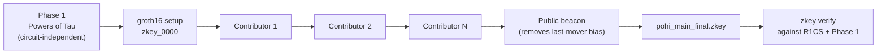

# Trusted Setup Ceremony Specification

This document defines the trusted setup procedure for the **Proof of Human Intent (PoHI)** Groth16 proving system, and states precisely which security property the ceremony does and does not provide.

---

## 1. Why a Ceremony Is Required

Groth16 (whitepaper Ch.5 Section 5.2) was selected for its 128-byte proof and ~210,000 gas on-chain verification. That efficiency is paid for with a **circuit-specific trusted setup**: key generation samples secret randomness $\tau$ that must be destroyed. Anyone retaining $\tau$ can forge a proof for a statement that is false — that is, produce a valid `is_human = 1` proof for a session that never occurred.

This is the one security property of the protocol that cryptography alone cannot supply. It is a procedural guarantee.

> [!CAUTION]
> The key produced by `npm run circuits:build` is generated locally from deterministic, published entropy. It exists so the circuit can be compiled, proved and verified reproducibly in development and CI. **Anyone who runs the build knows the toxic waste.** It must never be used to verify a real transaction.

---

## 2. Security Property: 1-of-N Honesty

A multi-party ceremony chains contributions. Participant $i$ applies their own secret $s_i$, and the final secret is the product $\tau = \prod_i s_i$. Recovering $\tau$ requires **every** participant's secret.

$$\text{Setup is sound} \iff \exists\, i : \text{participant } i \text{ destroyed } s_i$$

The ceremony is therefore secure if **at least one** participant is honest, without anyone needing to know which one. Security strictly increases with the number and independence of participants.



---

## 3. Phase 1 — Powers of Tau

Phase 1 is **circuit-independent** and must not be re-run locally. Reuse an existing large ceremony; the customary choice is the Perpetual Powers of Tau, which has accumulated many independent contributions.

The PoHI circuit compiles to 12,481 constraints, so the $2^{14}$ (16,384) file is the smallest sufficient one.

Place it at:

```
circuits/ptau/powersOfTau28_hez_final_14.ptau
```

`circuits/ceremony.mjs` detects this file automatically and records its SHA-256 in the transcript. If it is absent the tooling falls back to the development file and marks the ceremony `production: false` in every output.

> [!NOTE]
> Obtaining and verifying the phase-1 file is a deliberate manual step. Verify its hash against the ceremony's published attestations before use — a substituted phase-1 file voids the entire guarantee.

---

## 4. Phase 2 — Circuit-Specific Ceremony

Phase 2 must be re-run whenever the circuit changes, because the constraint system is baked into the key. `ceremony.mjs verify` refuses to pass if the R1CS hash no longer matches the transcript.

### 4.1 Procedure

```bash
# Coordinator, once:
npm run circuits:build
node circuits/ceremony.mjs init

# Each participant, on their own machine:
node circuits/ceremony.mjs contribute "Alice <alice@example.org>"

# Coordinator, after the final contribution:
node circuits/ceremony.mjs finalize <beacon-hex> 10
node circuits/ceremony.mjs verify
```

### 4.2 Participant Obligations

1. Run the contribution on a machine you control.
2. Entropy is drawn from the OS CSPRNG and never written to disk. Reboot, or discard the VM, after contributing.
3. Publish the SHA-256 of your output file so third parties can confirm your contribution is in the chain.
4. Never share your machine state, memory dump, or swap file from the contribution session.

### 4.3 The Final Beacon

The last contributor could, in principle, bias the outcome by repeatedly re-running their contribution until the key has some property they want. Applying a public **verifiable delay beacon** afterwards removes this: the beacon input must be a value that nobody could predict at contribution time, such as the hash of a future Bitcoin block agreed in advance.

Record the chosen block height publicly **before** the ceremony begins.

---

## 5. Transcript and Verification

`circuits/ceremony/transcript.json` records the phase-1 file and its hash, every contribution with participant name and output hash, and the beacon parameters and final hashes.

Any third party can independently verify:

```bash
node circuits/ceremony.mjs verify
```

This runs `snarkjs zkey verify` over the full contribution chain against the R1CS and the phase-1 file, and confirms the circuit has not changed since the ceremony began.

Publish the transcript alongside the verification key. A ceremony whose transcript is not public provides no assurance to anyone who did not participate.

`circuits/ceremony/` is gitignored by default, so that a local development run is never mistaken for a real ceremony. When a genuine ceremony is held, commit its record explicitly:

```bash
git add -f circuits/ceremony/transcript.json circuits/ceremony/verification_key.json
```

Until such a commit exists in the repository history, no published claim may rely on Theorem 7.2 holding in practice.

---

## 6. Deployment Checklist

| Requirement | Verified by |
| :--- | :--- |
| Phase 1 from a large public ceremony | `transcript.json` → `phase1.production = true`, hash checked against published attestations |
| At least one independent contributor | `transcript.json` → `contributions` length, contributor attestations |
| Final beacon applied | `transcript.json` → `finalized.beacon` |
| Key matches the deployed circuit | `node circuits/ceremony.mjs verify` |
| Transcript published | Manual |

Until every row is satisfied, the deployment is running on an unverified setup and the soundness guarantee of Theorem 7.2 does not hold in practice.

---

## 7. Cross-References

- For the proof system rationale, see [CRYPTOGRAPHY.md](CRYPTOGRAPHY.md).
- For the soundness theorem this ceremony underwrites, see [THREAT_MODEL.md](THREAT_MODEL.md) Theorem 7.2.
- For release authority over setup artifacts, see [GOVERNANCE.md](../GOVERNANCE.md).
