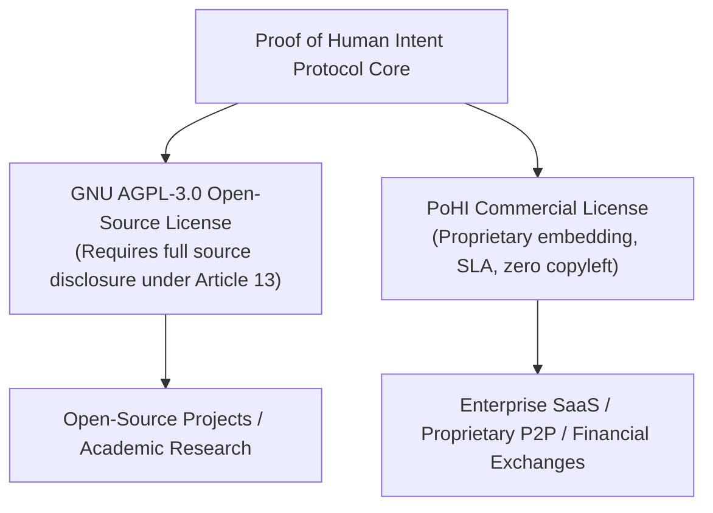
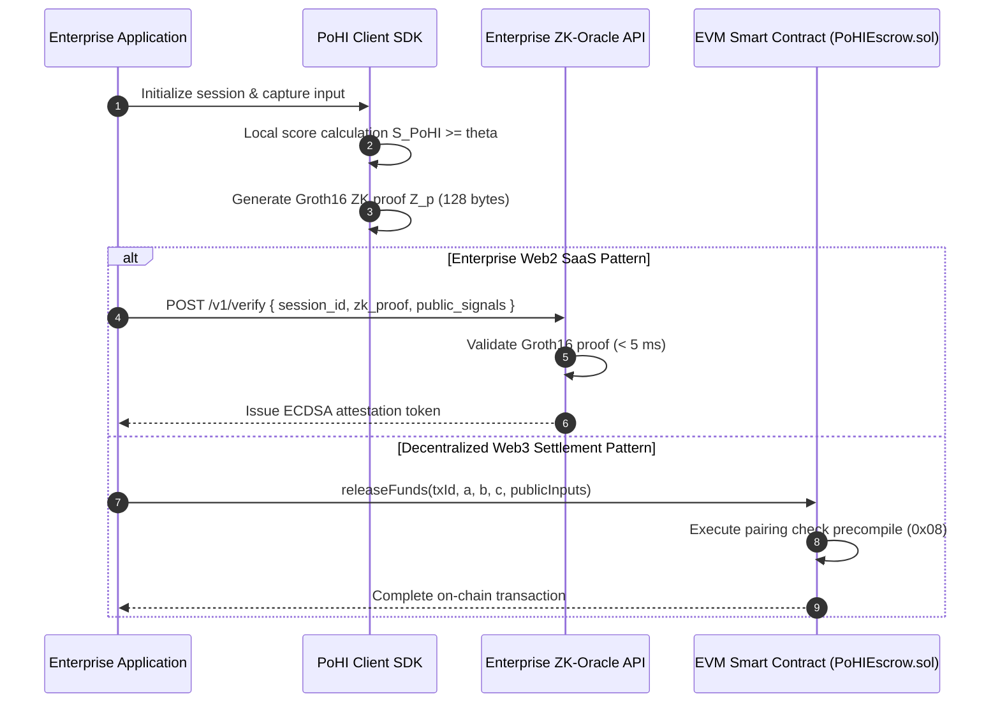

# Enterprise Integration & Commercial Guide

This document details commercial licensing, enterprise integration patterns, domain parameter tuning, and API interfaces for deploying the **Proof of Human Intent (PoHI)** protocol in enterprise environments, based on Chapters 9, 13, and 14 of the research whitepaper.

---

## 1. Commercial Dual-Licensing Architecture

The PoHI protocol operates under a dual-licensing structure designed to accommodate open-source community research while supporting proprietary enterprise software integrations.

### 1.1 Why Obtain a Commercial License?
- **Exemption from AGPL-3.0 Copyleft**: Permits embedding `@pohi-protocol/sdk-web` and zero-knowledge circuit definitions into proprietary closed-source applications.
- **SaaS Network Copyleft Immunity**: Operating the stateless ZK-Oracle API over network interfaces does not require releasing internal proprietary backend source code under AGPL-3.0 Article 13.
- **Custom Parameter Calibration**: Access to specialized domain tuning, dedicated proving key setup ceremonies, and enterprise SLA support.

---

## 2. Enterprise Integration Patterns

PoHI supports two primary enterprise integration architectures:

---

## 3. Domain Parameter Calibration Matrix

Enterprise platforms configure weighting parameters $(\alpha, \beta, \gamma)$ and security threshold $\theta$ based on domain risk models:

| Enterprise Domain | Alpha ($\alpha$ - Motor $S_F$) | Beta ($\beta$ - Cogn. $\tau$) | Gamma ($\gamma$ - Error $\sigma^2$) | Threshold ($\theta$) | Target SLA / Risk Profile |
| :--- | :--- | :--- | :--- | :--- | :--- |
| **P2P Financial Escrow** | 0.30 | 0.50 | 0.20 | 0.85 | High Financial Security |
| **B2B Merchant Messaging**| 0.40 | 0.40 | 0.20 | 0.75 | Balanced Conversion |
| **Gaming Guild Chat** | 0.70 | 0.15 | 0.15 | 0.60 | Low Latency Messaging |
| **Public Community Forum**| 0.50 | 0.25 | 0.25 | 0.55 | Fluid User Onboarding |

---

## 4. API & Integration Reference

### 4.1 Stateless ZK-Oracle Endpoint (`POST /v1/verify`)
Verifies client proofs in $< 5\text{ ms}$ and issues signed ECDSA tokens for Web2 backend authentication. Refer to OpenAPI 3.0 schema specs in [ARCHITECTURE.md](ARCHITECTURE.md).

### 4.2 TypeScript Client SDK (`@pohi-protocol/sdk-web`)
Provides background WebWorker ZK proof generation without blocking UI threads.

### 4.3 On-Chain EVM Escrow Contract (`PoHIEscrow.sol`)
Executes on-chain verification using Ethereum's native alt_bn128 pairing precompile at address `0x08` (~210,000 gas execution overhead).

### 4.4 Mobile Native SDK (`@pohi-protocol/sdk-mobile`)
- *Status*: **Reserved for future implementation** (iOS Swift / Android Kotlin native bindings).

---

## 5. Commercial Contact & Inquiries

For commercial licensing quotes, enterprise integration support, SLA guarantees, or custom circuit configurations, contact:

- **Author / Lead Maintainer**: Alejandro Gutiérrez
- **Email**: [alejandro.gutierrezb31@gmail.com](mailto:alejandro.gutierrezb31@gmail.com)
- **GitHub Repository**: [https://github.com/ProjectOne2020/pohi-protocol-poc](https://github.com/ProjectOne2020/pohi-protocol-poc)
- **LinkedIn**: [https://www.linkedin.com/in/alejandro-guti%C3%A9rrez-9a0318107/](https://www.linkedin.com/in/alejandro-guti%C3%A9rrez-9a0318107/)
