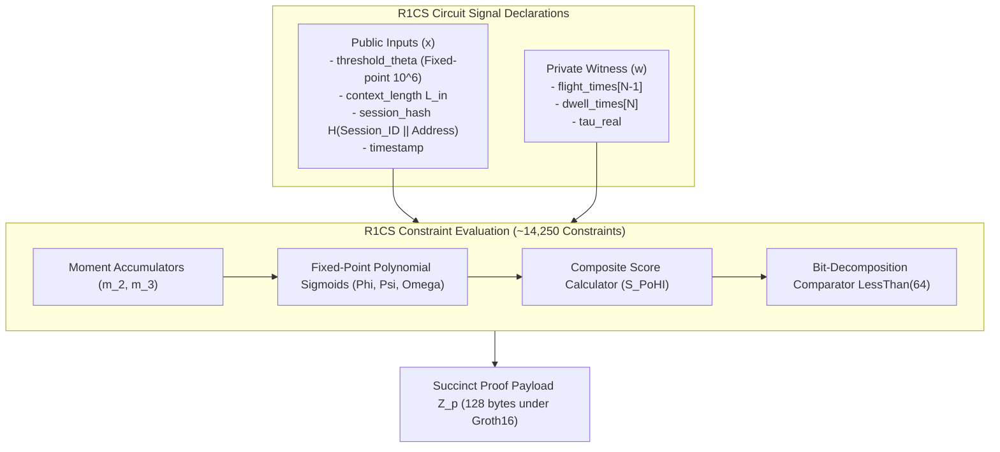

# Cryptographic & Zero-Knowledge Circuit Specification

This document provides the formal mathematical and cryptographic specification for the Zero-Knowledge proof system deployed in the **Proof of Human Intent (PoHI)** protocol, based on Chapters 2, 5, and 7 of the whitepaper.

---

## 1. Zero-Knowledge Proof System & Circuit Formulation

PoHI implements a Zero-Knowledge Succinct Non-Interactive Argument of Knowledge (zk-SNARK) based on the **Groth16** pairing-friendly proof system defined over the **BN254** (alt_bn128) elliptic curve.

### 1.1 R1CS Arithmetic Circuit Representation
Computation is encoded into a Rank-1 Constraint System (R1CS) over finite field $\mathbb{F}_p$:

$$(\mathbf{A}_i \cdot \mathbf{s}) \times (\mathbf{B}_i \cdot \mathbf{s}) = (\mathbf{C}_i \cdot \mathbf{s})$$

Where $\mathbf{s} = [1, x, w]^T$ is the combined vector containing public inputs $x$, private witness $w$, and intermediate circuit signals.



---

## 2. Circuit Signal Declarations

### 2.1 Public Input Signals ($x$)
- `threshold_theta`: Fixed-point representation ($10^6$ multiplier) of target threshold score $\theta$.
- `context_length`: Character length $L_{in}$ of the prompt context payload.
- `session_hash`: Cryptographic commitment $H(\text{Session\_ID} \parallel \text{User\_Address})$.
- `timestamp`: Session completion epoch timestamp.
- `alpha`, `beta`, `gamma`: Equation 3.7 domain calibration weights ($10^6$ multiplier).

The calibration weights are public because they constitute the verifier's security policy; see [PROTOCOL.md](PROTOCOL.md) Section 3.1.

### 2.2 Private Witness Signals ($w$)
- `flight_times[N-1]`: Array of private inter-key flight latencies in milliseconds.
- `dwell_times[N]`: Array of private key actuation dwell times in milliseconds.
- `tau_real`: Measured cognitive assimilation latency in milliseconds.
- `backspace_selector[N-1]`: Boolean mask encoding the Equation 3.5 index set $\mathcal{I}_{back}$.

The dwell vector is part of the documented witness (Equation 3.1) and is range-checked, but does not enter $S_{PoHI}$: Equation 3.7 is a function of $S_F$, $R_{cog}$ and $\sigma^2_{err}$ only.

### 2.3 Constraint Operations & Polynomial Approximations
1. **Moment Accumulator Constraints**: Computes variance $m_2$ and third moment $m_3$ over `flight_times` using fixed-point integer arithmetic. Deviations are carried at an internal precision of $10^{-3}$ ms; the scale factors cancel exactly in the ratio $S_F = m_3 / m_2^{3/2}$, so no residual correction is applied. The $3/2$ power is evaluated as $m_2 \cdot \lfloor\sqrt{m_2}\rfloor$, with the integer square root constrained by $s^2 \le m_2 < (s+1)^2$.
2. **Fixed-Point Sigmoid Approximation**: Implements a 5th-degree polynomial approximation of the logistic function over finite field $\mathbb{F}_p$. Because $\sigma(z) - 0.5$ is odd, the approximation is restricted to the odd basis, which removes $c_0$, $c_2$ and $c_4$ and makes $P(0) = 0.5$ hold exactly:
   $$P_{sig}(z) \approx 0.5 + c_1 z + c_3 z^3 + c_5 z^5$$
   The coefficients are **derived, not chosen**: `circuits/tools/derive_sigmoid_coefficients.mjs` fits them to the $\kappa$ and reference values fixed by `@pohi-protocol/core-math` using Iteratively Reweighted Least Squares driven to the minimax criterion. The solution equioscillates at $\pm 0.011790$, confirming minimax optimality for this basis.
3. **Saturation Clamping**: A degree-5 polynomial cannot represent the sigmoid tails, so evaluation is clamped to $|z| \le 5$ and the output is clamped to $[0, 1]$ as Equation 3.6 requires.
4. **Proved Integer Division**: Every rescaling is a constrained integer division proving $\text{numerator} = q \cdot d + r$ with $0 \le r < d$ and both $q, r$ bit-decomposed. Circom's `/` operator is *field* division and cannot be used for fixed-point rescaling: `q <-- a/SCALE; q*SCALE === a;` is tautological and constrains nothing.
5. **Threshold Comparator Constraint**: Computes score $S_{PoHI}$ and enforces the validity assertion using a genuine bit-decomposition comparator (circomlib `GreaterEqThan(64)`, built on `Num2Bits`):
   $$b_{valid} = \left( S_{PoHI} \ge \text{threshold\_theta} \right)$$
   A finite field has no native order, so a comparison written as `out <-- a > b ? 1 : 0` produces no constraint binding `out` to the operands and must never be used.

### 2.4 Measured Circuit Complexity

Compiled with `circom 2.2.3` for $N = 30$ (`npm run circuits:build`):

| Metric | Value |
| :--- | :--- |
| Curve | BN254 (`bn-128`) |
| Total R1CS constraints | **11,170** |
| Non-linear constraints | 10,682 |
| Linear constraints | 488 |
| Wires | 11,016 |
| Public inputs | 7 |
| Private inputs | 89 |
| Public outputs | 1 (`is_human`) |

### 2.5 Numerical Accuracy Bound

The degree-5 approximation mandated above has a worst-case error of $0.0122$ against the exact logistic function. Since $S_{PoHI}$ is a convex combination of three such approximations, the composite score inherits the same bound:

$$\left| S_{PoHI}^{circuit} - S_{PoHI}^{exact} \right| \le 0.0122$$

Sessions whose exact score lies within $0.0122$ of $\theta$ may therefore be classified differently by the circuit and by the reference engine. Narrowing this band requires raising the polynomial degree, which is a change to the whitepaper specification and thus a Protocol Specification Proposal (see [GOVERNANCE.md](../GOVERNANCE.md)).

---

## 3. Proof System Trade-Off & Benchmark Matrix

The following matrix presents empirical benchmarks and trade-off evaluations across proof systems evaluated for PoHI client execution:

| Metric | Groth16 (BN254) | PLONK (KZG) | Halo2 (IPA) | zk-STARK |
| :--- | :--- | :--- | :--- | :--- |
| **Constraint Model** | 14,250 R1CS | 9,800 Custom Gates | 11,200 Gates | Hash Execution Trace |
| **WASM Proving Time (PC)** | 420 ms | 890 ms | 1,450 ms | ~3,200 ms |
| **WASM Proving Time (Mobile)** | 1,150 ms | 2,400 ms | 3,900 ms | ~8,500 ms |
| **Peak WASM Memory** | 48 MB | 110 MB | 165 MB | 320 MB |
| **Proof Payload Size** | 128 bytes | 384 bytes | 2.4 KB | 50–200 KB |
| **On-Chain EVM Verification Gas**| ~210,000 gas | ~290,000 gas | ~1,200,000 gas | ~4,500,000 gas |
| **Setup Ceremony Type** | Trusted Per-Circuit | Universal SRS | Transparent | Transparent |
| **Post-Quantum Safe?** | No | No | No | YES |

### Selection Rationale:
- **Groth16** is selected as the primary settlement standard due to its minimal proof payload size (128 bytes), fast mobile proving time ($1,150\text{ ms}$), and low EVM verification gas (~210,000 gas).
- **PLONK** is supported as an enterprise fallback where circuit-specific trusted setups are undesirable.

---

## 4. On-Chain & Off-Chain Verification Mechanics

### 4.1 Off-Chain ZK-Oracle API Verification
The stateless ZK-Oracle REST endpoint (`POST /v1/verify`) executes Groth16 proof verification off-chain in $< 5\text{ ms}$, issuing an ECDSA-signed attestation token.

### 4.2 On-Chain EVM Smart Contract Verification (`PoHIEscrow.sol`)
On-chain settlement invokes Ethereum's native alt_bn128 pairing precompile at address `0x08`:

```solidity
function releaseFunds(
    bytes32 txId,
    uint256[2] memory a,
    uint256[2][2] memory b,
    uint256[2] memory c,
    uint256[2] memory publicInputs
) external {
    EscrowTransaction storage txn = escrows[txId];
    require(publicInputs[0] >= THRESHOLD_THETA, "PoHIEscrow: Insufficient score threshold");
    
    // Executes pairing check via precompile 0x08
    bool isValid = IZKVerifier(zkVerifierContract).verifyProof(a, b, c, publicInputs);
    require(isValid, "PoHIEscrow: Invalid ZK proof");
    
    txn.state = EscrowState.RELEASED;
    txn.seller.transfer(txn.amount);
}
```

---

## 5. Cryptographic Hardness Assumptions

1. **Computational Discrete Logarithm Problem**: Hardness of computing scalar $k$ given $G$ and $k \cdot G$ over curve BN254.
2. **$q$-PAIRING Hardness**: Computational intractability of breaking bilinear pairing maps $e: \mathbb{G}_1 \times \mathbb{G}_2 \to \mathbb{G}_T$.

---

## 6. Cross-References

- For system component architecture, see [ARCHITECTURE.md](ARCHITECTURE.md).
- For protocol execution sequence, see [PROTOCOL.md](PROTOCOL.md).
- For formal security proofs, see [THREAT_MODEL.md](THREAT_MODEL.md).
