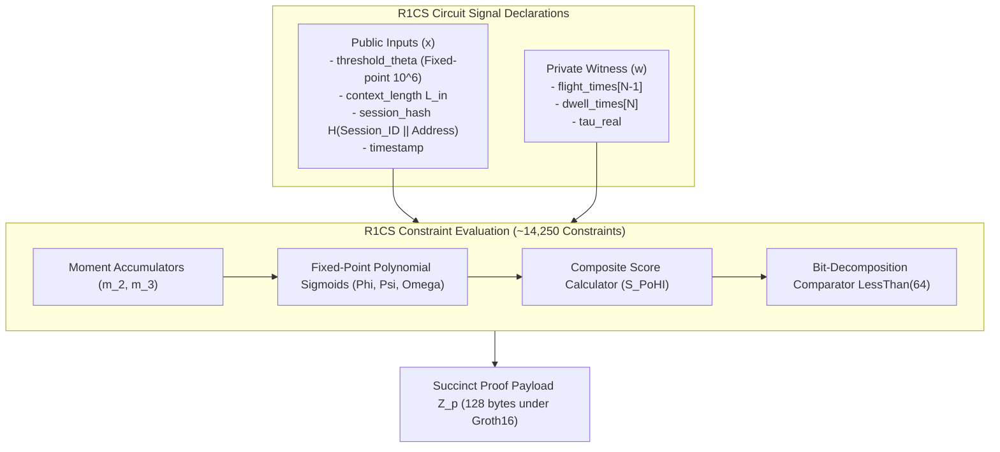

# Cryptographic & Zero-Knowledge Circuit Specification

This document provides the formal mathematical and cryptographic specification for the Zero-Knowledge proof system deployed in the **Proof of Human Intent (PoHI)** protocol, based on Chapters 2, 5, and 7 of the whitepaper.

---

## 1. Zero-Knowledge Proof System & Circuit Formulation

PoHI implements a Zero-Knowledge Succinct Non-Interactive Argument of Knowledge (zk-SNARK) based on the **Groth16** pairing-friendly proof system defined over the **BN254** (alt_bn128) elliptic curve.

### 1.1 R1CS Arithmetic Circuit Representation
Computation is encoded into a Rank-1 Constraint System (R1CS) over finite field $\mathbb{F}_p$:

$$(\mathbf{A}_i \cdot \mathbf{s}) \times (\mathbf{B}_i \cdot \mathbf{s}) = (\mathbf{C}_i \cdot \mathbf{s})$$

Where $\mathbf{s} = [1, x, w]^T$ is the combined vector containing public inputs $x$, private witness $w$, and intermediate circuit signals.



---

## 2. Circuit Signal Declarations

### 2.1 Public Input Signals ($x$)
- `threshold_theta`: Fixed-point representation ($10^6$ multiplier) of target threshold score $\theta$.
- `context_length`: Character length $L_{in}$ of the prompt context payload.
- `session_hash`: Cryptographic commitment $H(\text{Session\_ID} \parallel \text{User\_Address})$.
- `timestamp`: Session completion epoch timestamp.

### 2.2 Private Witness Signals ($w$)
- `flight_times[N-1]`: Array of private inter-key flight latencies in milliseconds.
- `dwell_times[N]`: Array of private key actuation dwell times in milliseconds.
- `tau_real`: Measured cognitive assimilation latency in milliseconds.

### 2.3 Constraint Operations & Polynomial Approximations
1. **Moment Accumulator Constraints**: Computes variance $m_2$ and third moment $m_3$ over `flight_times` using fixed-point integer arithmetic (scaling factor $10^6$).
2. **Fixed-Point Sigmoid Approximation**: Implements 5th-degree minimax polynomial approximations for sigmoidal functions $(\Phi, \Psi, \Omega)$ over finite field $\mathbb{F}_p$:
   $$P_{sig}(x) \approx c_0 + c_1 x + c_2 x^2 + c_3 x^3 + c_4 x^4 + c_5 x^5$$
3. **Threshold Comparator Constraint**: Computes score $S_{PoHI}$ and enforces the boolean inequality constraint using a bit-decomposition less-than operator (`LessThan(64)`):
   $$\text{LessThan}(64)\left( \text{threshold\_theta}, S_{PoHI} \right) === 1$$

Total circuit constraint count for an $N=30$ character input session: **$\approx 14,250$ R1CS constraints** under BN254 curve geometry.

---

## 3. Proof System Trade-Off & Benchmark Matrix

The following matrix presents empirical benchmarks and trade-off evaluations across proof systems evaluated for PoHI client execution:

| Metric | Groth16 (BN254) | PLONK (KZG) | Halo2 (IPA) | zk-STARK |
| :--- | :--- | :--- | :--- | :--- |
| **Constraint Model** | 14,250 R1CS | 9,800 Custom Gates | 11,200 Gates | Hash Execution Trace |
| **WASM Proving Time (PC)** | 420 ms | 890 ms | 1,450 ms | ~3,200 ms |
| **WASM Proving Time (Mobile)** | 1,150 ms | 2,400 ms | 3,900 ms | ~8,500 ms |
| **Peak WASM Memory** | 48 MB | 110 MB | 165 MB | 320 MB |
| **Proof Payload Size** | 128 bytes | 384 bytes | 2.4 KB | 50–200 KB |
| **On-Chain EVM Verification Gas**| ~210,000 gas | ~290,000 gas | ~1,200,000 gas | ~4,500,000 gas |
| **Setup Ceremony Type** | Trusted Per-Circuit | Universal SRS | Transparent | Transparent |
| **Post-Quantum Safe?** | No | No | No | YES |

### Selection Rationale:
- **Groth16** is selected as the primary settlement standard due to its minimal proof payload size (128 bytes), fast mobile proving time ($1,150\text{ ms}$), and low EVM verification gas (~210,000 gas).
- **PLONK** is supported as an enterprise fallback where circuit-specific trusted setups are undesirable.

---

## 4. On-Chain & Off-Chain Verification Mechanics

### 4.1 Off-Chain ZK-Oracle API Verification
The stateless ZK-Oracle REST endpoint (`POST /v1/verify`) executes Groth16 proof verification off-chain in $< 5\text{ ms}$, issuing an ECDSA-signed attestation token.

### 4.2 On-Chain EVM Smart Contract Verification (`PoHIEscrow.sol`)
On-chain settlement invokes Ethereum's native alt_bn128 pairing precompile at address `0x08`:

```solidity
function releaseFunds(
    bytes32 txId,
    uint256[2] memory a,
    uint256[2][2] memory b,
    uint256[2] memory c,
    uint256[2] memory publicInputs
) external {
    EscrowTransaction storage txn = escrows[txId];
    require(publicInputs[0] >= THRESHOLD_THETA, "PoHIEscrow: Insufficient score threshold");
    
    // Executes pairing check via precompile 0x08
    bool isValid = IZKVerifier(zkVerifierContract).verifyProof(a, b, c, publicInputs);
    require(isValid, "PoHIEscrow: Invalid ZK proof");
    
    txn.state = EscrowState.RELEASED;
    txn.seller.transfer(txn.amount);
}
```

---

## 5. Cryptographic Hardness Assumptions

1. **Computational Discrete Logarithm Problem**: Hardness of computing scalar $k$ given $G$ and $k \cdot G$ over curve BN254.
2. **$q$-PAIRING Hardness**: Computational intractability of breaking bilinear pairing maps $e: \mathbb{G}_1 \times \mathbb{G}_2 \to \mathbb{G}_T$.

---

## 6. Cross-References

- For system component architecture, see [ARCHITECTURE.md](ARCHITECTURE.md).
- For protocol execution sequence, see [PROTOCOL.md](PROTOCOL.md).
- For formal security proofs, see [THREAT_MODEL.md](THREAT_MODEL.md).
