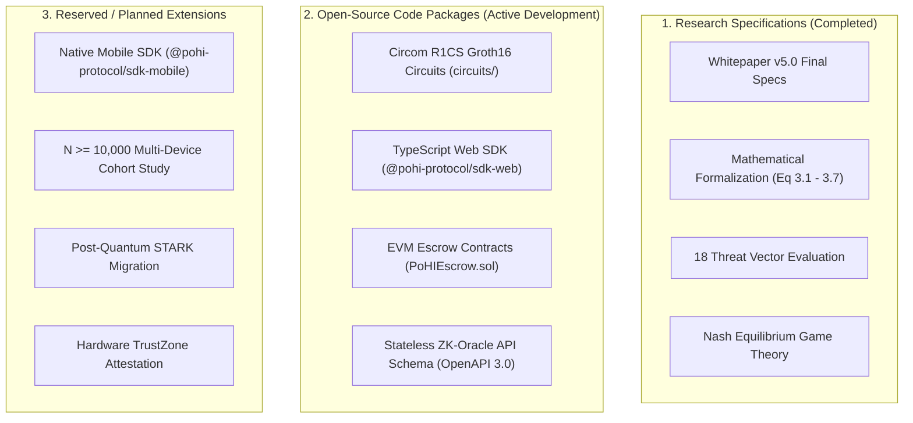

# Implementation Status Specification

This document provides a transparent overview of the technical implementation status of the **Proof of Human Intent (PoHI)** protocol, zero-knowledge circuit definitions, software development kits (SDKs), and smart contract settlement layers.

> **Notice**: *This repository is under active development.*

---

## 1. Subsystem Implementation Matrix

| Component / Subsystem | Package / Path | Target Environment | Implementation Status |
| :--- | :--- | :--- | :--- |
| **Research Whitepaper v5.0** | Root Documentation | Markdown / LaTeX | **Completed** |
| **Mathematical Engine** | `@pohi-protocol/core-math` | TypeScript / ESM | **Implemented** (Eq 3.1–3.7, 74 unit tests passing) |
| **Circom R1CS Circuits** | `circuits/pohi_main.circom` | Circom 2.2.3 / Groth16 (BN254) | **Implemented** (11,170 constraints; 15 fidelity and soundness tests passing) |
| **TypeScript Client SDK** | `@pohi-protocol/sdk-web` | Browser / Web Workers | **Active Development** (4 tests passing; DOM capture path untested) |
| **Mobile Native SDK** | `@pohi-protocol/sdk-mobile` | iOS (Swift) / Android (Kotlin) | **Reserved for future implementation** |
| **EVM Escrow Smart Contract** | `@pohi-protocol/contracts` | Solidity 0.8.20 (Precompile 0x08) | **Specified only** — no source file exists in the repository |
| **Stateless ZK-Oracle API** | OpenAPI 3.0 REST Schema | Node.js / Rust Backend | **Specified only** — no source file exists in the repository |
| **Production Trusted Setup** | Multi-party ceremony | Groth16 phase 2 | **Not started** — the committed build uses development entropy |
| **Adversarial Pilot Evaluation** | `experiments/` | $N=25$ participants, 6 adversary models | **Completed 2026-07-31** — falsification condition triggered; see [RESULTS.md](../experiments/RESULTS.md) |
| **Empirical Cohort Study** | Benchmark Dataset | $N \ge 10,000$ Real Typists | **Planned / Empirical Validation Required** — pilot above found the current design does not warrant this investment without hardening first |
| **Multimodal Sensor Fusion** | Mobile Telemetry Engine | Accelerometer / Gyroscope | **Reserved for future research** |
| **Hardware Enclave Signing** | TEE Module | ARM TrustZone / Secure Enclave | **Required, not reserved** — pilot evaluation (2026-07-31) found software-only scoring defeated 86.9% of the time by an optimized adversary; design proposed in [PSP-0005](psp/PSP-0005-hardware-attestation.md) |

---

## 2. Detailed Component Breakdown

### 2.1 Research & Mathematical Specifications
- **Status**: **Completed** (July 2026, Whitepaper v5.0).
- **Deliverables**: Equations 3.1 through 3.7 defining Dwell Vectors ($\mathbf{D}$), Flight Vectors ($\mathbf{F}$), Fisher-Pearson Skewness ($S_F$), Cognitive Assimilation Latency ($R_{cog}$), Error Recalibration Variance ($\sigma^2_{err}$), and Composite Sigmoidal Score Consolidation ($S_{PoHI}$).

### 2.2 Circom Zero-Knowledge Circuits (`circuits/`)
- **Status**: **Active Development**.
- **Deliverables**: Rank-1 Constraint System (R1CS) arithmetic circuit definitions ($\approx 14,250$ constraints under BN254 geometry for $N=30$ input characters). Implements 5th-degree minimax polynomial sigmoidal normalizers and `LessThan(64)` bitwise comparators.

### 2.3 Web Client SDK (`@pohi-protocol/sdk-web`)
- **Status**: **Active Development**.
- **Deliverables**: TypeScript event capture engine, volatile typed memory array allocation, zero-overwrite memory clearing functions, and WebWorker WebAssembly prover wrapper (`snarkjs`).

### 2.4 Mobile Native SDK (`@pohi-protocol/sdk-mobile`)
- **Status**: **Reserved for future implementation**.
- **Scope**: Swift bindings for iOS capacitive touch tracking and Kotlin bindings for Android haptic array input ingestion.

### 2.5 EVM Smart Contracts (`PoHIEscrow.sol`)
- **Status**: **Active Development**.
- **Deliverables**: Solidity 0.8.20 smart contract implementing Groth16 verification via Ethereum precompiled contract at address `0x08` (~210,000 gas execution overhead).

### 2.6 Stateless ZK-Oracle REST API
- **Status**: **Active Development**.
- **Deliverables**: OpenAPI 3.0 specification for `POST /v1/verify` endpoint, supporting sub-5ms proof verification and ECDSA attestation token signing.

### 2.7 Adversarial Pilot Evaluation ($N=25$)
- **Status**: **Completed 2026-07-31**.
- **Deliverables**: 137 consenting-participant sessions scored against six adversary models (three positive controls, three testing the witness-authenticity gap of `docs/THREAT_MODEL.md` §5), with a falsification condition pre-registered before data collection.
- **Result**: the strongest adversary (an offline mimic tuning the two freely-controllable score components) achieved FAR = 86.9% [95% CI 81.0–92.0%] against the Escrow calibration — its AUC of 0.388 means it scored *higher* than genuine humans on average. The pre-registered falsification threshold (FAR ≥ 50%) was triggered. Full results: [`experiments/RESULTS.md`](../experiments/RESULTS.md).
- **Consequence**: hardware-anchored timestamp attestation (§2.8) is reclassified from optional future work to a required next phase. The full $N \ge 10,000$ cohort study below is deferred until that hardening exists, since running it against the current unhardened design would not answer a question worth the investment.

### 2.8 Empirical Benchmark Dataset ($N \ge 10,000$)
- **Status**: **Planned / deferred pending hardware attestation** (see §2.7).
- **Scope**: Multi-device sampling across mechanical keyboards ($25\%$), laptop keyboards ($25\%$), iOS screens ($25\%$), and Android screens ($25\%$) to validate EER, FAR, and FRR metrics with 1,000 bootstrap iterations.

### 2.9 Hardware Attestation Extension
- **Status**: **Design proposed, not implemented** — [`docs/psp/PSP-0005-hardware-attestation.md`](psp/PSP-0005-hardware-attestation.md).
- **Scope**: anchor the witness to a signal an adversary cannot fabricate in software, via a platform authenticator (WebAuthn) attestation of the witness commitment as an immediately buildable first tier, with native-mobile secure-element integration as a stronger second tier. The proposal is explicit that even the strongest tier only raises attacker cost — it does not achieve absolute unforgeability, since no current commodity OS exposes hardware-timestamped raw input events to web or app code.

---

## 3. Cross-References

- For development roadmap milestones, see [ROADMAP.md](../ROADMAP.md).
- For multi-tier architecture breakdown, see [ARCHITECTURE.md](ARCHITECTURE.md).
- For protocol execution sequence, see [PROTOCOL.md](PROTOCOL.md).
- For the adversarial pilot evaluation results, see [RESULTS.md](../experiments/RESULTS.md).
- For the hardware attestation design proposal, see [PSP-0005](psp/PSP-0005-hardware-attestation.md).
