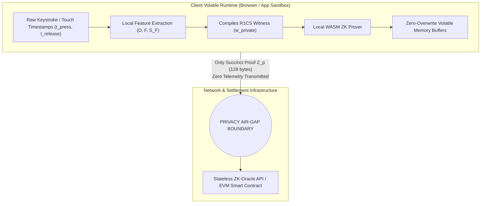

# Privacy Architecture & Regulatory Compliance

This document outlines the privacy preservation guarantees, data protection mechanics, and international regulatory compliance framework for the **Proof of Human Intent (PoHI)** protocol, based on Chapters 1, 4, 5, and 7 of the whitepaper.

---

## 1. Privacy Air-Gap Architecture

Traditional behavioral biometrics and central identity systems require capturing, transmitting, and storing raw timing logs or anatomical biometric templates. PoHI enforces a complete **Client-Side Privacy Air-Gap**.

### Key Technical Air-Gap Principles:
1. **Volatile In-Memory Processing**: Raw timing telemetry ($\mathbf{D}, \mathbf{F}$) is allocated strictly in volatile typed arrays (`Float64Array`) inside the client sandbox.
2. **Zero-Overwrite Memory Clearing**: Immediately following witness compilation, raw arrays are explicitly overwritten with zeroes, preventing keylogging or side-channel memory extraction.
3. **Zero Telemetry Transmission**: Zero raw timestamps, keystroke characters, or timing vectors leave the client device over network interfaces.

---

## 2. Cryptographic Privacy Proof

> [!NOTE]
> **Theorem 7.1 (Biometric Zero-Knowledge Confidentiality)**
> Under the zero-knowledge property of the Groth16 proof system over curve BN254, an adversary inspecting the public transcript $\mathcal{T} = \{x_{public}, Z_p\}$ gains zero computational information regarding the raw biometric telemetry vector $\mathbf{w} = \{\mathbf{D}, \mathbf{F}, \tau_{real}\}$.
>
> **Proof Sketch**: The Groth16 proof payload $Z_p = (A \in \mathbb{G}_1, B \in \mathbb{G}_2, C \in \mathbb{G}_1)$ is element-wise randomized by scalar multiplication with random field elements $r, s \in \mathbb{F}_q^*$ during proof generation. There exists a probabilistic polynomial-time (PPT) simulator $\mathcal{S}$ that produces a simulated transcript $\mathcal{T}_{sim}$ statistically indistinguishable from $\mathcal{T}$ without access to witness $\mathbf{w}$. Thus, zero biometric telemetry crosses the privacy boundary. $\blacksquare$

---

## 3. Regulatory Compliance Framework

### 3.1 General Data Protection Regulation (GDPR - Regulation (EU) 2016/679)
- **Article 9 (Biometric Data for Unique Identification)**: PoHI does not process or store biometric data centrally for user identification. Verification is local and probabilistic (*"Is this session biological human intent?"* rather than *"Who is this user?"*), satisfying privacy-by-design requirements.
- **Data Minimization (Article 5(1)(c))**: Only a 128-byte zero-knowledge proof payload ($Z_p$) is transmitted to settlement layers, establishing total data minimization.
- **Right to be Forgotten (Article 17)**: Because zero personal data or biometric profiles are stored on servers, there are zero databases or biometric tables to purge.

### 3.2 California Consumer Privacy Act (CCPA / CPRA)
- **Exemption from Personal Information Transfer**: PoHI does not collect, store, or sell personal identifiers or biometric timing profiles, exempting platforms using PoHI from third-party data tracking disclosures.

---

## 4. Privacy Matrix: PoHI vs. Alternative Paradigms

| Feature / Metric | PoHI (Ours) | Centralized Behavioral Bio | Google reCAPTCHA v3 | World ID Iris Scan | Device Fingerprinting |
| :--- | :--- | :--- | :--- | :--- | :--- |
| **Biometric Raw Data Location**| Local Volatile (WASM) | Centralized Server | Google Tracking Servers | Hardware Orb Device | Centralized Fraud Servers |
| **Network Data Transmitted** | 128-Byte ZK Proof ($Z_p$) | Raw Timestamps & Keys | Cross-site Tracking Cookies | ZK Iris Code Commitment | Browser API Hashes |
| **Centralized Database** | NONE | YES (Biometric Tables) | YES (Behavioral Profiles) | YES (Iris Hash Trees) | YES (Device Hashes) |
| **Keylogging Side-Channel Risk**| Zero (Air-Gap) | High (Raw Key Timings) | High (Mouse/Key Telemetry)| N/A | High (Font/Canvas Probe) |
| **GDPR Compliance** | Native Air-Gap | Complex (Requires Consent)| Poor (Tracker Exposure) | High (ZK Iris) | Poor (Rastreador) |

---

## 5. Cross-References

- For system architecture and component boundaries, see [ARCHITECTURE.md](ARCHITECTURE.md).
- For mathematical proof of Zero-Knowledge confidentiality, see [CRYPTOGRAPHY.md](CRYPTOGRAPHY.md).
- For formal threat modeling, see [THREAT_MODEL.md](THREAT_MODEL.md).
