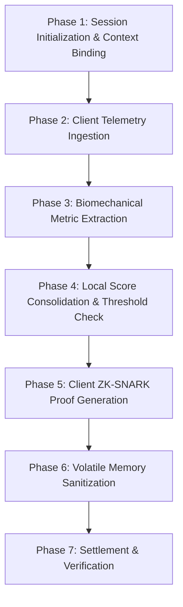
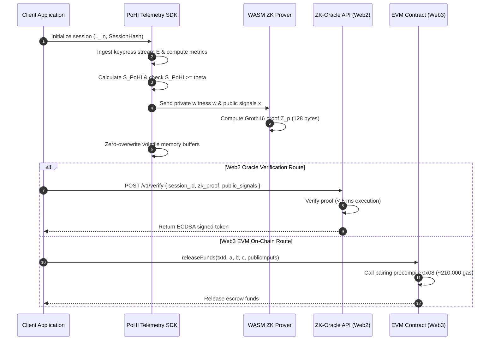

# PoHI Protocol Specification

This document provides the formal operational specification for the **Proof of Human Intent (PoHI)** protocol execution workflow, covering session initialization, telemetry extraction, local score evaluation, zero-knowledge witness compilation, and settlement verification.

---

## 1. Protocol Execution Phases

The PoHI protocol executes across seven sequential phases:

---

## 2. Phase-by-Phase Protocol Workflow

### Phase 1: Session Initialization & Context Binding
1. The application context registers a session with a unique cryptographic commitment:
   $$\text{SessionHash} = H(\text{Session\_ID} \parallel \text{User\_Address})$$
2. The prompt context character length $L_{in}$ is recorded.
3. Screen paint timestamp $t_{render}$ is captured via native frame callback (`requestAnimationFrame`).

### Phase 2: Client Telemetry Ingestion
1. Native event listeners log raw keypress sequence $\mathcal{E} = \{(k_i, t_{press,i}, t_{release,i})\}_{i=1}^n$.
2. All timestamps are written exclusively to volatile client typed arrays (`Float64Array`).

### Phase 3: Biomechanical Metric Extraction
From raw event stream $\mathcal{E}$, the client extracts:
- **Dwell Time Vector**: $\mathbf{D} = [d_1, \dots, d_n]^T$ where $d_i = t_{release,i} - t_{press,i}$.
- **Flight Time Vector**: $\mathbf{F} = [f_1, \dots, f_{n-1}]^T$ where $f_i = t_{press,i+1} - t_{release,i}$.
- **Fisher-Pearson Flight Skewness ($S_F$)**:
  $$S_F = \frac{\frac{1}{n-1} \sum_{i=1}^{n-1} (f_i - \bar{f})^3}{\left( \frac{1}{n-1} \sum_{i=1}^{n-1} (f_i - \bar{f})^2 \right)^{3/2}}$$
- **Cognitive Assimilation Ratio ($R_{cog}$)**:
  $$R_{cog} = \frac{t_{press,1} - t_{render}}{\left( \frac{L_{in}}{\lambda_{bio}} + \delta_{cognitive} \right)}$$
- **Stochastic Correction Variance ($\sigma^2_{err}$)**: Computed across flight indices $\mathcal{I}_{back}$ adjacent to backspace deletion events.

### Phase 4: Local Score Consolidation
1. Sigmoidal normalization functions $(\Phi, \Psi, \Omega)$ map domain metrics onto $[0, 1]$.
2. Consolidated score $S_{PoHI}$ is computed:
   $$S_{PoHI} = \alpha \cdot \Phi(S_F) + \beta \cdot \Psi(R_{cog}) + \gamma \cdot \Omega(\sigma^2_{err})$$
3. Evaluate boolean assertion: $b_{valid} = (S_{PoHI} \ge \theta)$.

### Phase 5: Client ZK-SNARK Proof Generation
If $b_{valid} = 1$, the WASM prover compiles the witness into R1CS arithmetic circuit format and computes Groth16 proof $Z_p$:

$$Z_p = \text{Prove}(pk, x_{public}, w_{private})$$

### Phase 6: Volatile Memory Sanitization
Immediately following proof generation, the client SDK executes zero-overwrite memory clearing across all typed arrays containing raw telemetry vectors ($\mathbf{D}, \mathbf{F}$).

### Phase 7: Settlement & Verification
The proof $Z_p$ is submitted to the chosen settlement layer:

---

## 3. Signal & Witness Formats

### 3.1 Public Signals ($x_{public}$)
- `threshold_theta`: Fixed-point target score $\theta \times 10^6$.
- `context_length`: Character length $L_{in}$ of prompt context.
- `session_hash`: Commitment $H(\text{Session\_ID} \parallel \text{User\_Address})$.
- `timestamp`: Epoch completion timestamp.

### 3.2 Private Witness ($w_{private}$)
- `flight_times[N-1]`: Inter-key flight latencies in milliseconds.
- `dwell_times[N]`: Key actuation dwell times in milliseconds.
- `tau_real`: Measured cognitive assimilation latency.

---

## 4. Cross-References

- For circuit implementation details, see [CRYPTOGRAPHY.md](CRYPTOGRAPHY.md).
- For behavioral dynamics explanations, see [BEHAVIORAL_MODEL.md](BEHAVIORAL_MODEL.md).
- For multi-tier architecture design, see [ARCHITECTURE.md](ARCHITECTURE.md).
