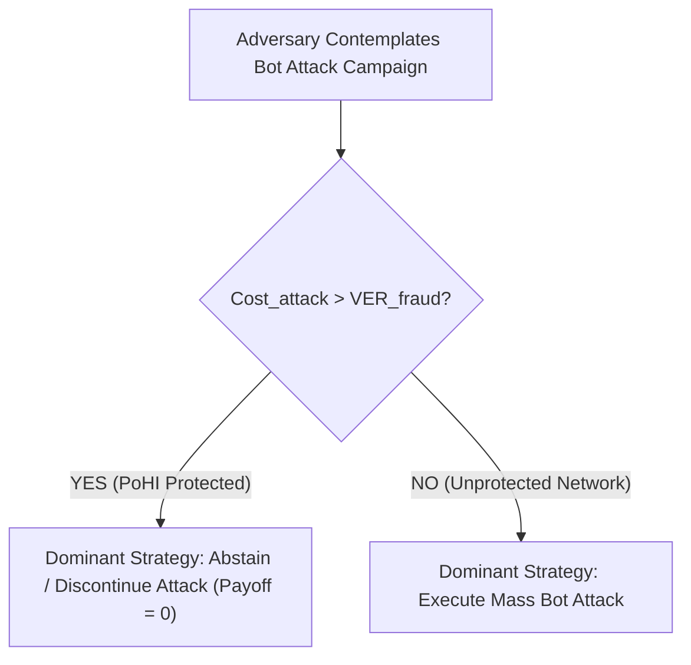

# Academic Research & Scientific Foundations

This document provides a comprehensive academic overview of the scientific foundations, mathematical theorems, game-theoretic economic proofs, and empirical methodology supporting the **Proof of Human Intent (PoHI)** protocol, based on whitepaper v5.0 (*July 2026*).

---

## 1. Research Problem & Theoretical Context

### 1.1 Historical Symmetric Cognitive Friction
For three decades, digital transaction security implicitly relied upon symmetric cognitive friction: human senders expended physical neuromuscular energy $E_{motor}$ and cognitive processing time $E_{cog}$ proportional to transaction volume $N$:

$$C_{op}(N) = \sum_{i=1}^{N} \left( E_{cog}(m_i) + E_{motor}(m_i) \right) = \Omega(N)$$

### 1.2 Computational Asymmetry & Generative AI Collapse
Autonomous AI swarms driven by Large Language Models (LLMs) optimized via RLHF reduce marginal synthetic generation costs to zero:

$$\lim_{N \to \infty} \frac{C_{op}^{synthetic}(N)}{N} \to 0$$

Generative models minimize cross-entropy loss $H(P, Q)$ and Kullback-Leibler divergence $D_{KL}(P \parallel Q)$:

$$D_{KL}(P \parallel Q) = \sum_{x \in \mathcal{X}} P(x) \log \left( \frac{P(x)}{Q(x)} \right) \to 0$$

> [!IMPORTANT]
> **Proposition 1.1 (Asymptotic Limit of Semantic Indistinguishability)**
> As $D_{KL}(P \parallel Q) \to 0$, any decision function $f_{detector}: \mathcal{X} \to \{0, 1\}$ operating exclusively on generated text payload $x \in \mathcal{X}$ encounters a maximum theoretical classification accuracy bound equivalent to random guessing:
> $$\lim_{D_{KL}(P \parallel Q) \to 0} P\left( f_{detector}(x) = y \right) = \frac{1}{2}$$

---

## 2. Taxonomy of Scientific Claims (v5.0 Audit Standard)

All assertions within the PoHI research framework are categorized into nine explicit epistemological classes:

1. **[Established Result from Literature]**: Peer-reviewed empirical findings (e.g., Fitts's Law constants, Fitts 1954; $8\text{--}12\text{ Hz}$ physiological tremor, Elble & Koller 1990; Groth16 proof size, Groth 2016).
2. **[Formal Mathematical Proposition]**: Proven mathematical boundaries (e.g., Proposition 1.1 on KL-divergence limit; Proposition 9.1 on Nash Equilibrium).
3. **[Architectural Design Decision]**: Core structural choices (e.g., Client-side privacy air-gap; R1CS circuit encoding; Decoupled REST/EVM verification).
4. **[Engineering Assumption]**: Operational prerequisites (e.g., Millisecond OS event driver timestamp accuracy; Non-tampered DOM event queues).
5. **[Cryptographic Assumption]**: Mathematical hardness postulates (e.g., Discrete Logarithm and $q$-PAIRING hardness over curve BN254).
6. **[Research Hypothesis]**: Proposed scientific models subject to future validation (e.g., Hypothesis that composite score $S_{PoHI}$ resists adaptive LLM physics emulators).
7. **[Implementation Consideration]**: Practical deployment guidelines (e.g., WASM memory allocation; Fixed-point scaling by $10^6$; Gas optimization via EVM precompile `0x08`).
8. **[Empirical Validation Required]**: Identified areas requiring future large-scale real-world testing (e.g., $N \ge 10,000$ cohort study; Cross-device touchscreen EER benchmarking).
9. **[Future Work]**: Planned extensions (e.g., Post-quantum STARK migration; Hardware TrustZone timestamp attestation; Eye-gaze ocular saccade tracking).

---

## 3. Game-Theoretic Economic Equilibrium

PoHI alters the Nash Equilibrium of automated fraud by shifting adversarial attack costs:

$$E[\Pi_{\mathcal{A}}] = N \cdot \left( p_{success} \cdot VER_{fraud} - Cost_{attack}^{PoHI} \right)$$

Where maintaining $p_{success} > 0$ under PoHI requires LLM text generation ($C_{LLM}$), GPU physics simulation ($C_{sim}$), and ZK proof compilation ($C_{ZK}$):

$$Cost_{attack}^{PoHI} = C_{LLM} + C_{sim} + C_{ZK} + \Delta_{infra}$$

> [!TIP]
> **Proposition 9.1 (PoHI Economic Nash Equilibrium)**
> If $Cost_{attack}^{PoHI} > VER_{fraud}$, the dominant strategy for all rational utility-maximizing adversaries in the extensive-form game is $\mathcal{S}_{adv} = \text{Abstain}$, forcing $E[\Pi_{\mathcal{A}}] \le 0$.

---

## 4. Empirical Benchmark Methodology (Planned)

To maintain scientific integrity without publishing synthetic results, empirical evaluation requirements are specified as follows:

- **Cohort Dataset Specification**: $N \ge 10,000$ biological subjects across mechanical desktop keyboards ($25\%$), laptop keyboards ($25\%$), iOS capacitive screens ($25\%$), and Android haptic screens ($25\%$).
- **Cross-Validation**: 10-Fold Stratified Cross-Validation with $B = 1,000$ non-parametric bootstrap resampling iterations for $95\%$ confidence intervals.
- **Formal Metric Equations**:
  $$\text{FAR}(\theta) = \frac{\text{FP}}{\text{FP} + \text{TN}} = \int_{\theta}^{1} p_{bot}(s) \, ds$$
  $$\text{FRR}(\theta) = \frac{\text{FN}}{\text{FN} + \text{TP}} = \int_{0}^{\theta} p_{human}(s) \, ds$$
  $$\text{EER} = \text{FAR}(\theta_{EER}) = \text{FRR}(\theta_{EER})$$
- *Status*: Planned / Empirical Validation Required.

---

## 5. Cross-References

- For mathematical metric equations, see [BEHAVIORAL_MODEL.md](BEHAVIORAL_MODEL.md).
- For zero-knowledge circuit proofs, see [CRYPTOGRAPHY.md](CRYPTOGRAPHY.md).
- For threat vector mitigations, see [THREAT_MODEL.md](THREAT_MODEL.md).
- For academic literature citations, see [REFERENCES.md](REFERENCES.md).
