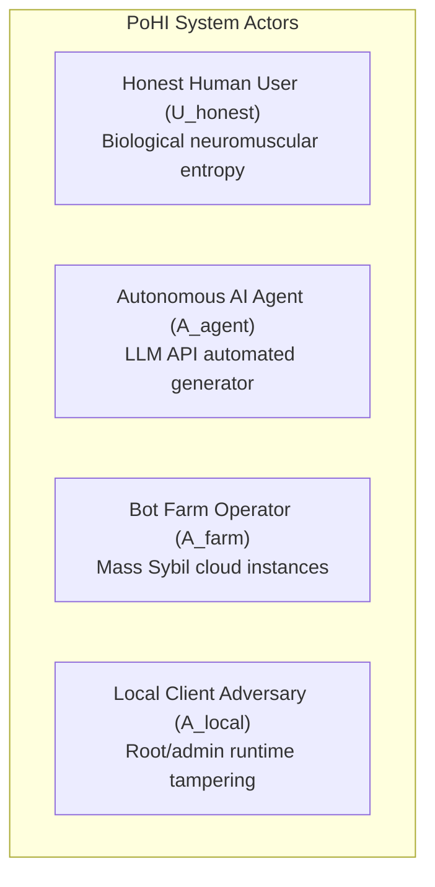
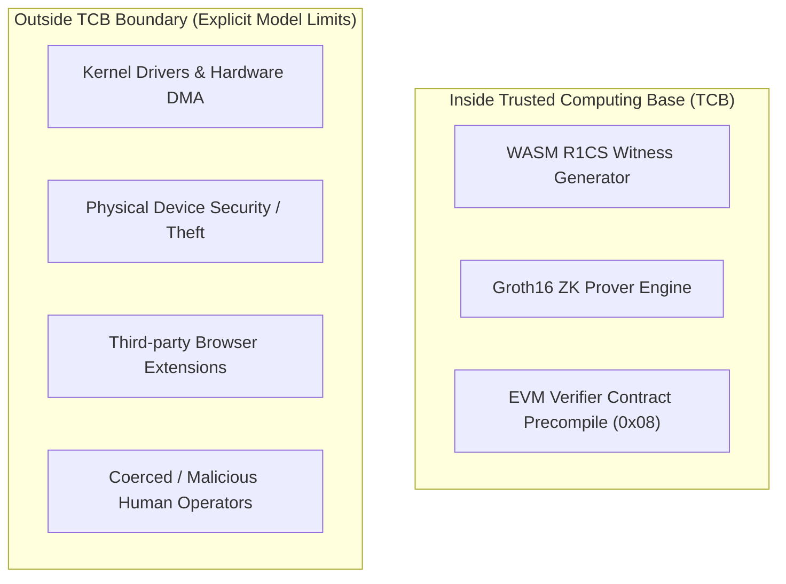

# Formal Threat Model Specification

This document details the formal threat model, actor definitions, security boundaries, and mitigations for the **Proof of Human Intent (PoHI)** protocol, based on Chapters 6, 7, and 8 of the research whitepaper.

---

## 1. System Actor Taxonomy

### 1.1 Honest Actors
- **Legitimate Human User ($\mathcal{U}_{honest}$)**: Interacts via physical keyboards or capacitive touchscreens. Exhibits involuntary physiological tremor ($8\text{--}12\text{ Hz}$), non-linear cognitive assimilation pauses, and natural typing skewness ($S_F > 1.0$).

### 1.2 Adversarial Classes
- **Autonomous AI Agent ($\mathcal{A}_{agent}$)**: Automated software driven by foundation LLMs emitting synthetic text payloads via webhooks or API endpoints.
- **Bot Farm Operator ($\mathcal{A}_{farm}$)**: Adversary managing thousands of concurrent virtualized instances to execute transactional fraud or Sybil attacks.
- **Local Client Adversary ($\mathcal{A}_{local}$)**: Adversary with root/admin access attempting to tamper with client-side witness compilation.

---

## 2. Comprehensive 18 Threat Vector Evaluation

| # | Threat Vector | Adversarial Assumptions | Adversarial Capabilities | Adversarial Limitations | PoHI Protocol Mitigation |
| :-: | :--- | :--- | :--- | :--- | :--- |
| 1 | Raw Software API Injection | Direct HTTP/WebSocket endpoint submission without UI. | Emits text payload in microseconds. | Produces zero event telemetry ($n=0$). | Rejected: $n=0$ produces score $S_{PoHI} = 0.0$. |
| 2 | Automation Frameworks | Operates via Headless Chrome, Playwright, or Puppeteer. | Simulates DOM keydown/keyup events via CDP script. | Events dispatched in synthetic batches. | Detected via `isTrusted` DOM flag and isochronous timing ($S_F \approx 0$). |
| 3 | OS Accessibility API Injection | Uses Android Accessibility or Windows UI Automation. | Programmatic text injection into input fields. | Bypasses physical touch sensors. | SDK detects AccessibilityService event source flag; penalizes score. |
| 4 | Emulators & Virtual Machines | Runs inside QEMU, Android Studio, or Genymotion. | Controls virtualized OS environment. | Fixed timer interrupt frequencies. | Detected via timer resolution jitter and low skewness ($S_F < 0.3$). |
| 5 | Clipboard Copy-Paste Injection | Copies LLM text into clipboard and pastes into field. | Injects full text string in single gesture. | Single paste event yields $n=1$. | Evaluates $\tau_{real}$; text length $L > 20$ with $n=1$ triggers score penalty. |
| 6 | Macro Scripting | AutoHotkey or xdotool timing loops. | Replays fixed key delay sequences (e.g., 50ms). | Timing intervals are constant. | $S_F \approx 0$; zero backspace recalibration variance ($\sigma^2_{err} = 0$). |
| 7 | Random Noise Injection | Adds uniform/Gaussian delays between synthetic keys. | Injects random delays $\text{Unif}(20, 150)\text{ms}$. | Uniform distributions are symmetric ($S_F \approx 0$). | Fisher-Pearson skewness metric $S_F$ penalizes symmetric noise. |
| 8 | Replay Attacks | Records real human session telemetry stream. | Replays historical timing vector. | Session hash commitment $H(\text{Session})$ differs. | ZK Circuit binds proof $Z_p$ to public input $H(\text{Session\_ID})$; replay fails. |
| 9 | Remote Desktop (RDP / VNC) | Controls target hardware via RDP or VNC. | Uses real device hardware. | Network packet jitter distorts timing. | Network latency variation distorts motor skewness bounds. |
| 10 | USB HID Hardware Injection | Rubber Ducky or Teensy microcontroller. | Appears as physical USB keyboard. | Microcontroller loops lack assimilation pauses. | $S_F$ skewness and $\tau_{real}$ assimilation detect sub-biological responses. |
| 11 | Robotic Key-Pressers | Servo motors or solenoids on screen. | Actuates capacitive touch sensors. | High hardware cost ($500+/bot). | Destroys bot ROI ($Cost_{attack} \gg VER_{fraud}$). |
| 12 | GAN Dynamic Timing Synthesis | GAN trained on human typing datasets. | Generates non-symmetric flight vectors. | High GPU inference latency per keypress. | Increases session cost; $\tau_{real}$ assimilation catches inference delays. |
| 13 | RL Evasion Agents | Policy Gradient optimization. | Optimizes timing parameters against local score. | Requires thousands of probe queries. | Client ZK proof generation increases GPU compute overhead. |
| 14 | Client Witness Tampering | Modifies local WASM code logic. | Injects fake positive score variable. | Cannot forge valid proof $Z_p$. | Computational soundness of Groth16 prevents invalid proof generation. |
| 15 | Man-in-the-Middle Relays | Intercepts network traffic. | Modifies ZK proof payload in transit. | Cannot forge Oracle ECDSA key. | Signature verification on-chain or at Oracle API fails instantly. |
| 16 | Sybil Swarm Attack | Instantiates 100,000 cloud instances. | Mass account creation attempts. | Proving & simulation costs scale linearly. | Cost scales linearly with $N$ at high marginal cost per instance. |
| 17 | Human Click Farms | Routes sessions to human click farm operators. | Uses real human typing entropy. | High human labor cost ($0.05--0.20/msg). | Converts zero-cost bot attack into high-cost human friction model. |
| 18 | AI-Assisted Human Workflow | Human typist manually types LLM text. | Human types LLM recommendations. | Human exhibits natural motor entropy. | PoHI validates genuine biological human intent to execute session. |

---

## 3. Cryptographic Proofs & Security Guarantees

> [!NOTE]
> **Theorem 7.1 (Biometric Zero-Knowledge Confidentiality)**
> Under the zero-knowledge property of Groth16, an adversary inspecting public transcript $\mathcal{T} = \{x_{public}, Z_p\}$ gains zero computational information regarding private telemetry witness $\mathbf{w} = \{\mathbf{D}, \mathbf{F}, \tau_{real}\}$. Proof elements $(A, B, C)$ are randomized by scalar multiplication with field elements $r, s \in \mathbb{F}_q^*$.

> [!NOTE]
> **Theorem 7.2 (Proof Soundness)**
> Under Discrete Logarithm and $q$-PAIRING computational hardness assumptions over curve BN254, no polynomial-time adversary can forge a valid proof $Z_p^*$ for a failing session ($S_{PoHI} < \theta$) with probability greater than $\text{negl}(\lambda)$.

---

## 4. Trusted Computing Base (TCB) & Model Boundaries

### 4.1 Model Boundaries & Non-Goals
- **Kernel Malware**: If an adversary possesses root/kernel access on the local client device, input events can be hooked before SDK capture.
- **Physical Coercion**: If an adversary physically coerces a human user to type, PoHI correctly detects biological human motor entropy. PoHI measures *physical presence*, not psychological intent.
- **Malicious Biological Humans**: PoHI validates manual scam execution by biological humans as human input. PoHI does not replace legal identity verification (KYC).

---

## 5. Cross-References

- For system component architecture, see [ARCHITECTURE.md](ARCHITECTURE.md).
- For protocol workflow details, see [PROTOCOL.md](PROTOCOL.md).
- For cryptographic circuit constraints, see [CRYPTOGRAPHY.md](CRYPTOGRAPHY.md).
