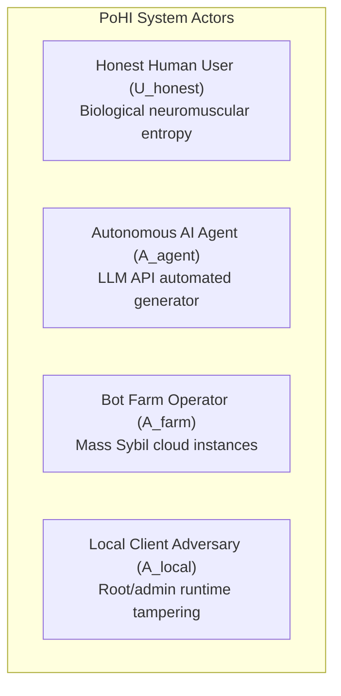
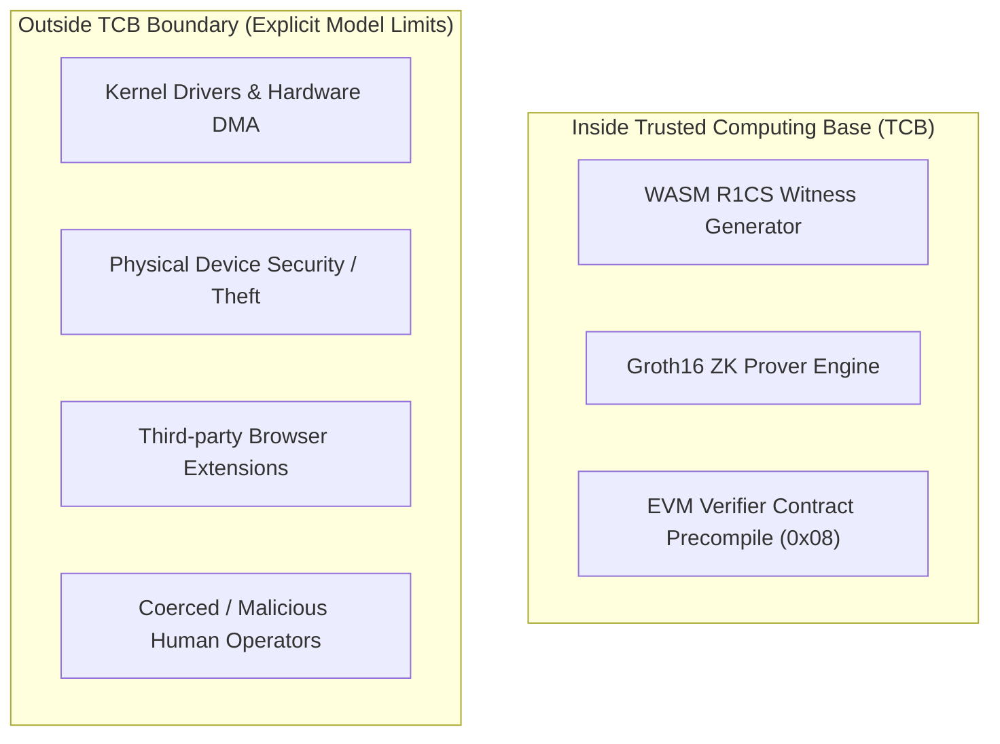

# Formal Threat Model Specification

This document details the formal threat model, actor definitions, security boundaries, and mitigations for the **Proof of Human Intent (PoHI)** protocol, based on Chapters 6, 7, and 8 of the research whitepaper.

---

## 1. System Actor Taxonomy

### 1.1 Honest Actors
- **Legitimate Human User ($\mathcal{U}_{honest}$)**: Interacts via physical keyboards or capacitive touchscreens. Exhibits involuntary physiological tremor ($8\text{--}12\text{ Hz}$), non-linear cognitive assimilation pauses, and natural typing skewness ($S_F > 1.0$).

### 1.2 Adversarial Classes
- **Autonomous AI Agent ($\mathcal{A}_{agent}$)**: Automated software driven by foundation LLMs emitting synthetic text payloads via webhooks or API endpoints.
- **Bot Farm Operator ($\mathcal{A}_{farm}$)**: Adversary managing thousands of concurrent virtualized instances to execute transactional fraud or Sybil attacks.
- **Local Client Adversary ($\mathcal{A}_{local}$)**: Adversary with root/admin access attempting to tamper with client-side witness compilation.

---

## 2. Comprehensive 18 Threat Vector Evaluation

| # | Threat Vector | Adversarial Assumptions | Adversarial Capabilities | Adversarial Limitations | PoHI Protocol Mitigation |
| :-: | :--- | :--- | :--- | :--- | :--- |
| 1 | Raw Software API Injection | Direct HTTP/WebSocket endpoint submission without UI. | Emits text payload in microseconds. | Produces zero event telemetry ($n=0$). | Rejected: $n=0$ produces score $S_{PoHI} = 0.0$. |
| 2 | Automation Frameworks | Operates via Headless Chrome, Playwright, or Puppeteer. | Simulates DOM keydown/keyup events via CDP script. | Events dispatched in synthetic batches. | Detected via `isTrusted` DOM flag and isochronous timing ($S_F \approx 0$). |
| 3 | OS Accessibility API Injection | Uses Android Accessibility or Windows UI Automation. | Programmatic text injection into input fields. | Bypasses physical touch sensors. | SDK detects AccessibilityService event source flag; penalizes score. |
| 4 | Emulators & Virtual Machines | Runs inside QEMU, Android Studio, or Genymotion. | Controls virtualized OS environment. | Fixed timer interrupt frequencies. | Detected via timer resolution jitter and low skewness ($S_F < 0.3$). |
| 5 | Clipboard Copy-Paste Injection | Copies LLM text into clipboard and pastes into field. | Injects full text string in single gesture. | Single paste event yields $n=1$. | Evaluates $\tau_{real}$; text length $L > 20$ with $n=1$ triggers score penalty. |
| 6 | Macro Scripting | AutoHotkey or xdotool timing loops. | Replays fixed key delay sequences (e.g., 50ms). | Timing intervals are constant. | $S_F \approx 0$; zero backspace recalibration variance ($\sigma^2_{err} = 0$). |
| 7 | Random Noise Injection | Adds uniform/Gaussian delays between synthetic keys. | Injects random delays $\text{Unif}(20, 150)\text{ms}$. | Uniform distributions are symmetric ($S_F \approx 0$). | Fisher-Pearson skewness metric $S_F$ penalizes symmetric noise. |
| 8 | Replay Attacks | Records real human session telemetry stream. | Replays historical timing vector. | Session hash commitment $H(\text{Session})$ differs. | ZK Circuit binds proof $Z_p$ to public input $H(\text{Session\_ID})$; replay fails. |
| 9 | Remote Desktop (RDP / VNC) | Controls target hardware via RDP or VNC. | Uses real device hardware. | Network packet jitter distorts timing. | Network latency variation distorts motor skewness bounds. |
| 10 | USB HID Hardware Injection | Rubber Ducky or Teensy microcontroller. | Appears as physical USB keyboard. | Microcontroller loops lack assimilation pauses. | $S_F$ skewness and $\tau_{real}$ assimilation detect sub-biological responses. |
| 11 | Robotic Key-Pressers | Servo motors or solenoids on screen. | Actuates capacitive touch sensors. | High hardware cost ($500+/bot). | Destroys bot ROI ($Cost_{attack} \gg VER_{fraud}$). |
| 12 | GAN Dynamic Timing Synthesis | GAN trained on human typing datasets. | Generates non-symmetric flight vectors. | High GPU inference latency per keypress. | Increases session cost; $\tau_{real}$ assimilation catches inference delays. |
| 13 | RL Evasion Agents | Policy Gradient optimization. | Optimizes timing parameters against local score. | Requires thousands of probe queries. | Client ZK proof generation increases GPU compute overhead. |
| 14 | Client Witness Tampering | Modifies local WASM code logic. | Injects fake positive score variable. | Cannot forge valid proof $Z_p$. | Computational soundness of Groth16 prevents invalid proof generation. |
| 15 | Man-in-the-Middle Relays | Intercepts network traffic. | Modifies ZK proof payload in transit. | Cannot forge Oracle ECDSA key. | Signature verification on-chain or at Oracle API fails instantly. |
| 16 | Sybil Swarm Attack | Instantiates 100,000 cloud instances. | Mass account creation attempts. | Proving & simulation costs scale linearly. | Cost scales linearly with $N$ at high marginal cost per instance. |
| 17 | Human Click Farms | Routes sessions to human click farm operators. | Uses real human typing entropy. | High human labor cost ($0.05--0.20/msg). | Converts zero-cost bot attack into high-cost human friction model. |
| 18 | AI-Assisted Human Workflow | Human typist manually types LLM text. | Human types LLM recommendations. | Human exhibits natural motor entropy. | PoHI validates genuine biological human intent to execute session. |

---

## 3. Cryptographic Proofs & Security Guarantees

> [!NOTE]
> **Theorem 7.1 (Biometric Zero-Knowledge Confidentiality)**
> Under the zero-knowledge property of Groth16, an adversary inspecting public transcript $\mathcal{T} = \{x_{public}, Z_p\}$ gains zero computational information regarding private telemetry witness $\mathbf{w} = \{\mathbf{D}, \mathbf{F}, \tau_{real}\}$. Proof elements $(A, B, C)$ are randomized by scalar multiplication with field elements $r, s \in \mathbb{F}_q^*$.

> [!NOTE]
> **Theorem 7.2 (Proof Soundness)**
> Under Discrete Logarithm and $q$-PAIRING computational hardness assumptions over curve BN254, no polynomial-time adversary can forge a valid proof $Z_p^*$ for a failing session ($S_{PoHI} < \theta$) with probability greater than $\text{negl}(\lambda)$.

---

## 4. Trusted Computing Base (TCB) & Model Boundaries

### 4.1 Model Boundaries & Non-Goals
- **Kernel Malware**: If an adversary possesses root/kernel access on the local client device, input events can be hooked before SDK capture.
- **Physical Coercion**: If an adversary physically coerces a human user to type, PoHI correctly detects biological human motor entropy. PoHI measures *physical presence*, not psychological intent.
- **Malicious Biological Humans**: PoHI validates manual scam execution by biological humans as human input. PoHI does not replace legal identity verification (KYC).

---

## 5. The Witness Authenticity Gap

> [!CAUTION]
> This section records a limitation of the protocol design that is **not** mitigated by any
> implementation work, and that materially qualifies threat vectors 2, 4, 6, 7, 10, 12, 13
> and 14 above. It is stated here rather than omitted because the credibility of the whole
> threat model depends on it being addressed openly.

### 5.1 Statement of the Gap

A zk-SNARK proves that the prover knows a witness $\mathbf{w}$ satisfying a public relation. The PoHI circuit proves:

$$\exists\, \mathbf{w} = \{\mathbf{D}, \mathbf{F}, \tau_{real}, \mathcal{I}_{back}\} \ :\ S_{PoHI}(\mathbf{w}) \ge \theta$$

It does **not** prove that $\mathbf{w}$ was produced by a human finger striking a key. The circuit receives numbers; it cannot observe their provenance.

Threat vector 14 states the adversarial limitation as *"ZK Prover cannot generate valid proof $Z_p$ without true witness"* and mitigates it by the computational soundness of Groth16. This reasoning does not hold. Groth16 soundness prevents proving a **false** statement. An adversary who fabricates a timing vector is proving a **true** statement — that those particular values score above the threshold — and obtains a cryptographically valid proof. No forgery of the proof system occurs, and none is needed.

The adversary does not require kernel access, WASM patching, or any tampering at all. It suffices to call the prover with chosen inputs.

### 5.2 Cost of Fabricating a Passing Witness

Threat vector 12 assigns the GAN adversary the limitation *"High GPU inference latency per keypress; breaks real-time bounds."* This assumes timing must be synthesised **online**, one keystroke at a time. It need not be. An adversary can:

1. Fit a distribution to a public keystroke corpus offline. Such corpora exist and are cited in this work's own bibliography.
2. Sample a flight vector from the fitted distribution — arithmetic on the order of microseconds, performed once.
3. Choose $\tau_{real}$ to place $R_{cog}$ anywhere desired; waiting is free, and the value is simply a number in the witness.
4. Set the correction mask and its adjacent flight times to produce any target $\sigma^2_{err}$.
5. Submit the vector to the prover.

Each of the three components of Equation 3.7 is independently and cheaply controllable in this model. The realistic marginal cost per session is therefore the **proving cost alone** — approximately 1.2 s of client compute — not the $C_{LLM} + C_{sim} + C_{ZK} + \Delta_{infra}$ of Chapter 9.

This weakens, but does not eliminate, Proposition 9.1: proving cost is still strictly greater than the $\$0.001$ of raw API injection, so the equilibrium shifts. It does not shift as far as $Cost_{attack}^{PoHI} > VER_{fraud}$ for high-value fraud.

### 5.3 What the Protocol Does and Does Not Guarantee

| Claim | Status |
| :--- | :--- |
| Raw telemetry never leaves the client | **Guaranteed** (Theorem 7.1, zero-knowledge property) |
| A proof cannot be replayed across sessions | **Guaranteed** (session commitment bound into the R1CS) |
| A failing session cannot yield `is_human = 1` | **Guaranteed** (circuit soundness, given an honest trusted setup) |
| Unsophisticated automation is rejected | **Guaranteed** (API injection, isochronous macros, naive replay all score below threshold) |
| The witness reflects genuine physical input | **NOT guaranteed** — no software-only mechanism can establish this |

The correct characterisation of PoHI is therefore a **cost-raising and friction-restoring mechanism with strong privacy guarantees**, not an unforgeable proof of human presence. Claims of unforgeability elsewhere in this repository are to be read as applying to the *proof system*, never to the *provenance of the witness*.

### 5.4 Research Directions That Would Close the Gap

The gap is closed only by anchoring the witness to something the adversary cannot fabricate:

1. **Hardware-attested timestamps** — signing raw sensor events inside ARM TrustZone or a Secure Enclave before witness compilation, and verifying the attestation signature in-circuit. Listed as future work in Chapter 12; it is in fact the load-bearing mitigation for this gap rather than an optional enhancement.
2. **Verifier-supplied timing challenges** — binding an unpredictable nonce, issued by the verifier at render time, into $t_{render}$, so $\tau_{real}$ measures an interval the prover could not have precomputed. This constrains one component without breaking the air-gap.
3. **Cross-session distributional consistency** — an adversary sampling independently per session produces a population distribution distinguishable from a single human's, at the cost of introducing linkable state and thus weakening the privacy properties.
4. **Empirical characterisation of the attack** — the honest scientific step: implement the offline-generation adversary and measure the achieved false acceptance rate. **Completed 2026-07-31; see Section 5.5.**

### 5.5 Empirical Measurement of the Gap (Completed, 2026-07-31)

Direction 4 above has been carried out. Full methodology, adversary implementations, and the pre-registered falsification condition are in `experiments/README.md`; the complete numerical results are in [RESULTS.md](../experiments/RESULTS.md) and whitepaper Section 10.4. Summary:

| Adversary | FAR at $\theta=0.85$ | AUC |
| :--- | :--- | :--- |
| Constant-delay / uniform / Gaussian jitter (positive controls) | 0.0% | 1.000 |
| Offline statistical mimic | 48.9% | 0.532 (CI spans 0.5 — indistinguishable from chance) |
| Raw telemetry replay | 46.0% | 0.509 (CI spans 0.5 — indistinguishable from chance) |
| **Optimized mimic (tunes $R_{cog}$, $\sigma^2_{err}$)** | **86.9%** | **0.388 (CI entirely below 0.5 — outscores real humans)** |

$N=137$ sessions from 25 participants. The pre-registered falsification threshold (FAR $\ge 50\%$ for the strongest adversary) was exceeded by a wide margin (86.9% vs. a CI lower bound of 81.0%). **Direction 1 (hardware-attested timestamps) is accordingly no longer a research suggestion — it is a required next step**, per the reclassification rule stated in `experiments/README.md` §1. A design proposal is drafted at [`docs/psp/PSP-0005-hardware-attestation.md`](psp/PSP-0005-hardware-attestation.md).

This measurement used $N=25$, sufficient to detect an effect of this size unambiguously, but far short of the $N \ge 10{,}000$ cohort of whitepaper Chapter 10 needed for production-grade FAR/FRR estimates. Treat this as settling *whether* hardening is needed, not as a final security certification.

---

## 6. Cross-References

- For system component architecture, see [ARCHITECTURE.md](ARCHITECTURE.md).
- For protocol workflow details, see [PROTOCOL.md](PROTOCOL.md).
- For cryptographic circuit constraints, see [CRYPTOGRAPHY.md](CRYPTOGRAPHY.md).
- For the trusted setup that underwrites Theorem 7.2, see [CEREMONY.md](CEREMONY.md).
- For the full empirical evaluation results, see [RESULTS.md](../experiments/RESULTS.md).
- For the hardware attestation design proposal, see [PSP-0005](psp/PSP-0005-hardware-attestation.md).
